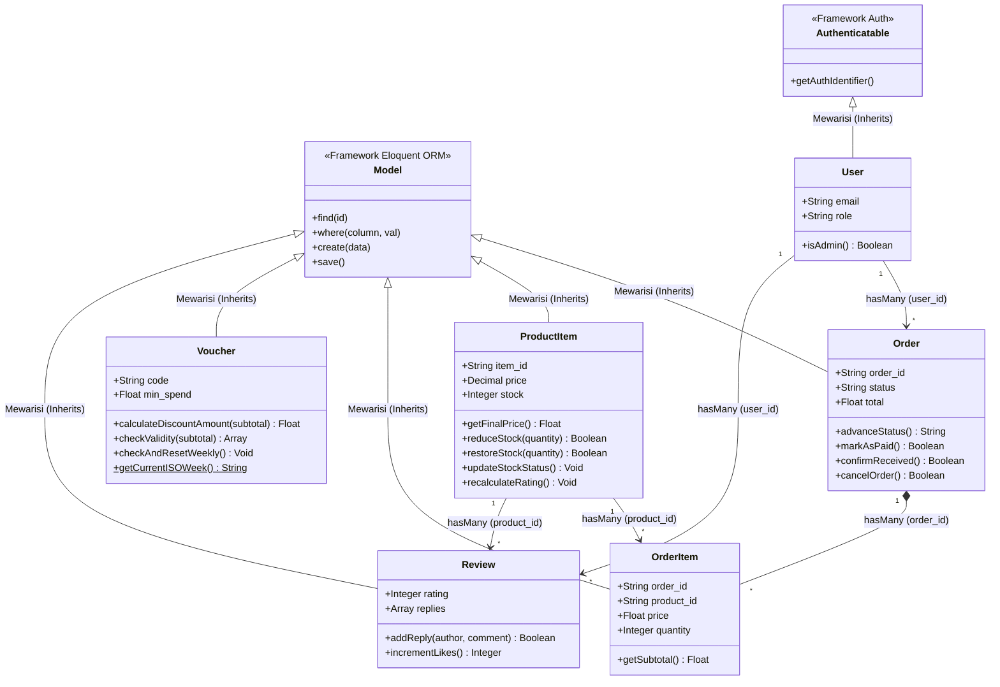

# 📚 DOKUMENTASI LENGKAP PEMROGRAMAN BERORIENTASI OBJEK (PBO / OOP)
## Platform Nefakky — Artisanal Culinary Marketplace & Enterprise System

---

## 📑 Daftar Isi
1. [Pengantar & Arsitektur PBO](#1-pengantar--arsitektur-pbo)
2. [Diagram Kelas (Class Diagram Mermaid)](#2-diagram-kelas-class-diagram)
3. [Penerapan 4 Pilar Utama PBO](#3-penerapan-4-pilar-utama-pbo)
4. [Bedah Detail Kelas Model Bisnis (Laravel Eloquent)](#4-bedah-detail-kelas-model-bisnis)
5. [Komposisi Objek & Traits (Solusi Multiple Inheritance)](#5-komposisi-objek--traits)
6. [Arsitektur Event-Driven & Polimorfisme](#6-arsitektur-event-driven--polimorfisme)
7. [Enkapsulasi Algoritma Matematika & ACID Transaction](#7-enkapsulasi-algoritma--acid-transaction)
8. [PBO pada Modul Django (Python) & TypeScript (Next.js)](#8-pbo-pada-modul-django--typescript)
9. [Tabel Tanya Jawab & Rangkuman untuk Sidang UKK](#9-tabel-rangkuman-untuk-sidang-ukk)

---

## 🏛️ 1. Pengantar & Arsitektur PBO

Project **Nefakky Culinary Marketplace** dirancang menggunakan paradigma **Pemrograman Berorientasi Objek (PBO / OOP)** secara murni. Seluruh entitas di dunia nyata (Pesanan, Menu Makanan, Voucher Promo, Pengguna, Ulasan) diabstraksikan menjadi **Class (Blueprint/Cetakan)** yang kemudian diinstansiasi menjadi **Object (Data Nyata)**.

Arsitektur sistem memisahkan tanggung jawab menggunakan pola **MVC (Model-View-Controller)**:
- **Model Layer**: Berisi representasi entitas data, aturan enkapsulasi data, relasi antar-tabel, dan metode mutasi state bisnis.
- **Controller Layer**: Bertindak sebagai orkestrator yang mengendalikan alur logika, memanggil metode bisnis pada objek, dan menangani request-response.
- **Resource / View Layer**: Mengabstraksikan struktur JSON output untuk konsumsi antarmuka frontend (Next.js 14).

---

## 🗺️ 2. Diagram Kelas (Class Diagram)

Berikut adalah visualisasi struktur arsitektur kelas, hierarki pewarisan (*inheritance*), dan hubungan relasi asosiasi antar-objek dalam sistem:



---

### 📖 Penjelasan Notasi & Simbol Diagram UML di Atas:

1. **Simbol Visibilitas & Metode**:
   * Simbol `+` (*Plus*): Menandakan hak akses **Public**, artinya properti atau metode tersebut dapat diakses dan dipanggil secara bebas dari luar kelas (misalnya oleh Controller).
   * Simbol `$` (*Dollar Sign*) pada `getCurrentISOWeek()$`: Menandakan **Static Method**, yaitu fungsi yang melekat langsung pada cetakan kelas dan dapat dipanggil langsung (`Voucher::getCurrentISOWeek()`) tanpa perlu membuat objek instan baru (`new Voucher`).
   * Tanda `<<Stereotype>>`: Menandakan kelas dasar bawaan framework (`Eloquent ORM` atau `Laravel Auth`).

2. **Garis Panah Segitiga Terbuka (`<|--` Pewarisan / Inheritance)**:
   * Menunjukkan relasi pewarisan sifat (*Generalization / "is-a" relationship*).
   * Contoh: `Model <|-- Order` berarti kelas `Order` adalah anak (*subclass*) dari kelas `Model` (*superclass*). Kelas `Order` otomatis mewarisi fungsi-fungsi database seperti `create()`, `find()`, `save()`, dan `where()`.
   * Contoh: `Authenticatable <|-- User` berarti kelas `User` mewarisi kemampuan otentikasi login dan hashing keamanan Laravel.

3. **Garis Panah Asosiasi (`"1" --> "*"` Relasi One-to-Many)**:
   * Menunjukkan hubungan keterkaitan data (*Association*) dengan kardinalitas **1 ke Banyak (1:N)**:
     * **`User "1" --> "*" Order`**: Satu akun pengguna (`User`) dapat memiliki banyak transaksi pesanan (`Order`).
     * **`User "1" --> "*" Review`**: Satu akun pengguna (`User`) dapat menulis banyak ulasan testimoni (`Review`).
     * **`ProductItem "1" --> "*" Review`**: Satu menu makanan (`ProductItem`) dapat menerima banyak ulasan rating dari berbagai pembeli.
     * **`ProductItem "1" --> "*" OrderItem`**: Satu menu makanan (`ProductItem`) dapat dibeli dan tercatat berulang kali pada berbagai transaksi pesanan (`OrderItem`).

4. **Garis Panah Belah Ketupat Hitam (`"1" *-- "*"` Komposisi / Composition)**:
   * Menunjukkan keterikatan kepemilikan yang sangat kuat (*Strong Ownership*).
   * **`Order "1" *-- "*" OrderItem`**: Objek `OrderItem` (rincian makanan) merupakan bagian integral dari `Order` (pesanan induk). Jika sebuah pesanan dihapus dari sistem, seluruh baris rincian item di dalamnya juga ikut terhapus secara otomatis (*Cascade Delete*).

---

## 💎 3. Penerapan 4 Pilar Utama PBO

| Pilar PBO | Konsep Dasar | Implementasi di Project Nefakky |
| :--- | :--- | :--- |
| **1. Enkapsulasi (*Encapsulation*)** | Membungkus data dan metode ke dalam kelas serta membatasi akses langsung dari luar (*Data Protection / Information Hiding*). | - Penggunaan `$fillable` (proteksi Mass Assignment)<br>- `$casts` (konversi tipe data otomatis)<br>- `$hidden` (menyembunyikan password hash)<br>- Metode internal: `reduceStock()`, `advanceStatus()`, `haversineFormula()` |
| **2. Pewarisan (*Inheritance*)** | Subclass mewarisi atribut dan metode dari Superclass (*is-a relationship*). | - `Order extends Model`<br>- `ProductItem extends Model`<br>- `User extends Authenticatable`<br>- `OrderController extends Controller`<br>- `StoreOrderRequest extends FormRequest` |
| **3. Polimorfisme (*Polymorphism*)** | Kemampuan objek merespons pesan yang sama dengan perilaku yang berbeda (*Method Overriding & Interface Realization*). | - `OrderPlacedEvent implements ShouldBroadcastNow` (meng-override metode `broadcastOn`, `broadcastAs`, `broadcastWith`)<br>- `MidtransPaymentService` meng-override metode `create_snap_transaction()` milik `BasePaymentService` |
| **4. Abstraksi (*Abstraction*)** | Menyembunyikan kerumitan teknis di balik antarmuka yang bersih dan sederhana. | - Pemanggilan relasi `$order->items` tanpa menulis query `JOIN` SQL manual<br>- Standardisasi balasan API via `ApiResponseTrait` (`$this->successResponse(...)`) |

---

## 🔍 4. Bedah Detail Kelas Model Bisnis

### 1. Model `Order` (`Laravel/app/Models/Order.php`)
Mengelola alur transaksi dan *State Machine* status pesanan 5 tahap dapur.
- **Konstanta Kelas (`public const STAGES`)**: Urutan resmi `RECEIVED` $\rightarrow$ `COOKING` $\rightarrow$ `READY` $\rightarrow$ `DELIVERING` $\rightarrow$ `COMPLETED`.
- **`advanceStatus()`**: Memajukan status pesanan secara bertahap dan merekam tanggal penyelesaian jika sudah tiba di tujuan.
- **`markAsPaid()`**: Mengubah status pembayaran menjadi `PAID` dan merekam timestamp `paid_at`.
- **`cancelOrder()`**: Membatalkan pesanan serta memanggil `$product->restoreStock($qty)` pada setiap hidangan untuk memulihkan stok inventaris secara otomatis.
- **Relasi**:
  - `user()` $\rightarrow$ `BelongsTo` (Many-to-One ke Model User).
  - `items()` $\rightarrow$ `HasMany` (One-to-Many ke Model OrderItem).

### 2. Model `ProductItem` (`Laravel/app/Models/ProductItem.php`)
Mengelola master hidangan, penghitungan diskon promo, mutasi stok, dan agregasi kepuasan.
- **`getFinalPrice()`**: Menghitung harga setelah dipotong persen diskon:
  $$\text{Harga Akhir} = \text{Harga} - \left(\text{Harga} \times \frac{\text{Diskon}}{100}\right)$$
- **`reduceStock($quantity)`**: Mengurangi stok, menambah jumlah porsi terjual (`sold_units`), dan memicu evaluasi status ketersediaan.
- **`restoreStock($quantity)`**: Mengembalikan jumlah stok jika ada pembatalan transaksi.
- **`updateStockStatus()`**: Menentukan status ketersediaan secara dinamis:
  - $\text{Stok} = 0 \implies \text{'Inactive'}$
  - $\text{Stok} \le 5 \implies \text{'Low Stock'}$
  - $\text{Stok} > 5 \implies \text{'Active'}$
- **`recalculateRating()`**: Menghitung ulang rata-rata skor bintang dari seluruh ulasan yang disetujui (`APPROVED`).

### 3. Model `Voucher` (`Laravel/app/Models/Voucher.php`)
Mengelola kupon promosi belanja, kuota pemakaian, dan aturan waktu.
- **`getCurrentISOWeek()` *(Static Method)***: Menghasilkan tahun dan minggu ISO berjalan (`YYYY-WW`) tanpa perlu membuat instansiasi objek (`new Voucher`).
- **`checkAndResetWeekly()`**: Logika auto-reset kuota voucher mingguan jika konfigurasi aktif.
- **`calculateDiscountAmount($subtotal)`**: Menghitung nominal rupiah diskon (persen dengan batas `max_discount` atau fixed nominal).
- **`checkValidity($subtotal)`**: Memeriksa 4 lapis validasi (keaktifan, batas kuota, minimum belanja `min_spend`, dan batasan hari *Weekend Only*).

### 4. Model `OrderItem` (`Laravel/app/Models/OrderItem.php`)
Menyimpan *snapshot* permanen rincian makanan saat transaksi checkout dilakukan agar data laporan keuangan tidak berubah jika harga master produk dinaikkan.
- **`getSubtotal()`**: Menghitung total harga baris item ($\text{price} \times \text{quantity}$).
- **Relasi**: `order()` (`BelongsTo` ke Order) dan `product()` (`BelongsTo` ke ProductItem).

### 5. Model `User` (`Laravel/app/Models/User.php`)
Mengelola entitas pengguna dan otentikasi login.
- **`protected $hidden`**: Mengenkapsulasi privasi dengan menyembunyikan kolom `password` dan `remember_token` dari serialisasi JSON API.
- **`casts()`**: Otomatis mengenkripsi kata sandi menggunakan algoritma hashing (`'password' => 'hashed'`).
- **`isAdmin()`**: Helper boolean untuk mengecek hak akses administrator.

### 6. Model `Review` (`Laravel/app/Models/Review.php`)
Menyimpan testimoni, foto hidangan, dan moderasi kepuasan pembeli.
- **`protected $casts`**: Mengonversi JSON array `photos` dan `replies` menjadi array PHP murni secara transparan.
- **`addReply($author, $comment)`**: Menambahkan tanggapan apresiasi resmi resto ke dalam ulasan.
- **`incrementLikes()`**: Menambahkan counter respon suka (*Like*).

---

## 🧩 5. Komposisi Objek & Traits

PHP menganut *Single Inheritance* (satu kelas hanya bisa mewarisi satu kelas induk). Untuk membagikan fungsionalitas ke banyak kelas tanpa hierarki yang rumit, digunakan **Traits**:

### 1. `ApiResponseTrait` (`Laravel/app/Traits/ApiResponseTrait.php`)
Diadopsi oleh seluruh Controller untuk menyeragamkan format respon JSON:
```php
trait ApiResponseTrait {
    public function successResponse($data, $message, $code = 200, $meta = null): JsonResponse;
    public function paginatedResponse(LengthAwarePaginator $paginator, $message): JsonResponse;
    public function createdResponse($data, $message): JsonResponse;
    public function errorResponse($message, $code = 400, $errors = null): JsonResponse;
    public function notFoundResponse($message = 'Data tidak ditemukan'): JsonResponse;
    public function forbiddenResponse($message): JsonResponse;
}
```

### 2. `BroadcastSafelyTrait` (`Laravel/app/Traits/BroadcastSafelyTrait.php`)
Menerapkan *Fault-Tolerant Programming*. Membungkus pemancaran event WebSocket Reverb dalam blok `try-catch` agar kegagalan server realtime tidak merusak transaksi utama di REST API.

---

## 📡 6. Arsitektur Event-Driven & Polimorfisme

### Kelas Event `OrderPlacedEvent` (`Laravel/app/Events/OrderPlacedEvent.php`)
Menerapkan pola *Observer/Publisher-Subscriber*:
1. **Interface Realization**: `class OrderPlacedEvent implements ShouldBroadcastNow`.
2. **Dependency Injection**: Konstruktor menerima objek `Order` via Type-Hinting:
   ```php
   public function __construct(Order $order) {
       $this->order = $order->loadMissing('items');
       $this->message = "Pesanan baru #{$order->order_id} dari {$order->customer_name} telah diterima!";
   }
   ```
3. **Method Overriding**: Meng-override metode bawaan Laravel:
   - `broadcastOn()` $\rightarrow$ Menentukan channel publik `orders` dan `activity-feed`.
   - `broadcastAs()` $\rightarrow$ Menentukan nama event kustom `order.placed`.
   - `broadcastWith()` $\rightarrow$ Menentukan struktur payload JSON yang dikirimkan.

---

## 📐 7. Enkapsulasi Algoritma & ACID Transaction

### 1. Enkapsulasi Rumus Matematika di `HaversineController`
Algoritma trigonometri bumi disembunyikan menggunakan *private method*:
```php
private function haversineFormula($lat1, $lon1, $lat2, $lon2): float
{
    $earthRadiusKm = 6371; // Radius planet Bumi dalam KM
    $dLat = deg2rad($lat2 - $lat1);
    $dLon = deg2rad($lon2 - $lon1);

    $a = sin($dLat / 2) * sin($dLat / 2) +
         cos(deg2rad($lat1)) * cos(deg2rad($lat2)) *
         sin($dLon / 2) * sin($dLon / 2);

    $c = 2 * atan2(sqrt($a), sqrt(1 - $a));
    return $earthRadiusKm * $c;
}
```

### 2. Orkestrasi Multi-Objek Berbasis ACID di `OrderController::store`
Mengkoordinasikan banyak kelas objek di dalam satu blok transaksi database atomik:
```php
return DB::transaction(function () use ($data, $itemsData) {
    // 1. Instansiasi Objek Order Header
    $order = Order::create($data);

    // 2. Loop Objek OrderItem & Mutasi Stok Objek ProductItem
    foreach ($itemsData as $item) {
        OrderItem::create([...]);
        $prod = ProductItem::find($item['product_id']);
        if ($prod) {
            $prod->reduceStock($item['quantity']); // Metode PBO Produk
        }
    }

    // 3. Mutasi Pemakaian Kuota Objek Voucher
    if (!empty($order->voucher_code)) {
        $voucher = Voucher::where('code', $order->voucher_code)->first();
        if ($voucher) {
            $voucher->increment('used_count');
        }
    }

    // 4. Pancarkan Objek Event Realtime
    $this->safeBroadcast(new OrderPlacedEvent($order));

    return $this->createdResponse(new OrderResource($order), 'Pesanan berhasil dibuat');
});
```

---

## 🐍 8. PBO pada Modul Django & TypeScript

### 1. Abstract Base Class di Django Python (`backend_django/api/services.py`)
- **Abstract Base Class**: `BasePaymentService` mendefinisikan kontrak interface `create_snap_transaction()` yang melempar `raise NotImplementedError`.
- **Inheritance & Polimorfisme**: `MidtransPaymentService(BasePaymentService)` meng-override metode tersebut untuk menghubungi endpoint Midtrans Snap API.
- **Class Method**: `HaversineDistanceCalculator` menggunakan dekorator `@classmethod` untuk perhitungan jarak tanpa instansiasi objek.

### 2. Type-Safe OOP di Next.js TypeScript (`src/lib/mapService.ts`)
- Menerapkan kontrak interface bertipe ketat (`MapCoordinates`, `MapSettings`).
- Menyediakan enkapsulasi pembacaan dan penyimpanan pengaturan ke `localStorage`.

---

## 🎓 9. Tabel Rangkuman untuk Sidang UKK

| No | Konsep PBO | Pertanyaan Penguji / Evaluator | Jawaban & Pembuktian di Kode |
| :---: | :--- | :--- | :--- |
| **1** | **Class & Object** | *Apa perbedaan Class dan Object di web ini?* | **Class** adalah cetakannya (misal `class Order`), sedangkan **Object** adalah satu baris data transaksi nyata di database (misal `$order = Order::find('ORD-88219')`). |
| **2** | **Encapsulation** | *Di mana letak enkapsulasi data pada project ini?* | Pada properti `$fillable`, `$casts`, `$hidden` di model, serta pembungkusan mutasi stok di metode `ProductItem::reduceStock()` dan rumus private `haversineFormula()`. |
| **3** | **Inheritance** | *Sebutkan contoh pewarisan (Inheritance) yang dibuat!* | `class Order extends Model` (mewarisi fungsi database), `class User extends Authenticatable`, dan `class OrderController extends Controller`. |
| **4** | **Polymorphism** | *Di mana terjadi polimorfisme (banyak bentuk)?* | Pada `OrderPlacedEvent` yang meng-override metode `broadcastOn()` dan `broadcastWith()`, serta `MidtransPaymentService` yang meng-override `create_snap_transaction()`. |
| **5** | **Abstraction** | *Apa manfaat abstraksi di project ini?* | Menyembunyikan query SQL yang rumit menjadi pemanggilan relasi sederhana seperti `$order->items` atau `$product->reviews`. |
| **6** | **Trait** | *Mengapa menggunakan Trait di Laravel?* | Untuk berbagi fungsi lintas Controller tanpa pewarisan bertingkat yang rumit, seperti `ApiResponseTrait` (format JSON) dan `BroadcastSafelyTrait` (WebSocket). |
| **7** | **Static Method** | *Kapan Static Method digunakan?* | Pada `Voucher::getCurrentISOWeek()` yang bisa dipanggil langsung tanpa perlu membuat objek instan baru (`new Voucher`). |
| **8** | **ACID Transaction** | *Bagaimana PBO menjamin keamanan data saat checkout?* | Menggunakan `DB::transaction()` yang memastikan pembuatan `Order`, penyimpanan `OrderItem`, dan pemotongan stok di `ProductItem` berhasil seluruhnya atau dibatalkan semua jika gagal (*Rollback*). |

---

> 📌 **Lokasi File Dokumen**: Berkas ini tersimpan di `f:\UKK\RINGKASAN_OOP_PBO.md` sebagai referensi resmi dokumentasi teknis dan materi pengujian UKK.
