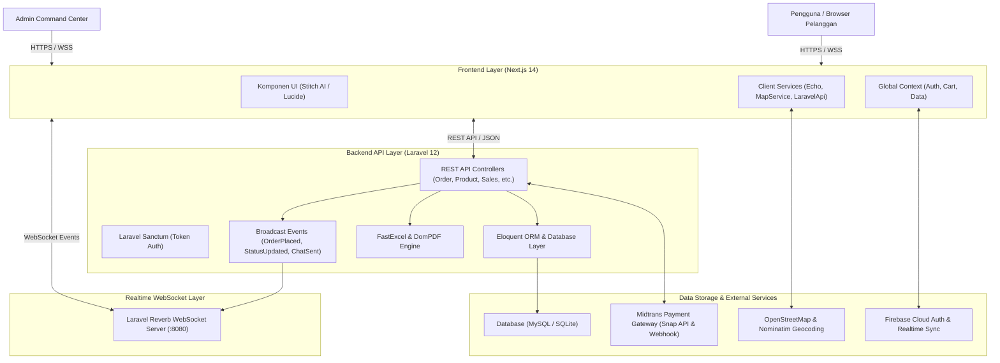

# Arsitektur Sistem: Nefakky Artisanal Culinary Marketplace

**Versi Dokumen**: 3.6.0  
**Status**: Production Architecture  
**Penulis**: Tim Pengembang Nefakky (Fatih Ahmad Zakky)  

---

## 1. Gambaran Umum Arsitektur (High-Level Architecture)

Nefakky menggunakan arsitektur modern **Decoupled Full-Stack Architecture** yang memisahkan antara frontend aplikasi pengguna (*Client-Side Application*) dengan backend penyedia layanan data dan transaksi (*Server-Side API*).

---

## 2. Layering & Pembagian Komponen

### 2.1 Frontend Layer (`nefakky3`)
* **Framework**: Next.js 14.2 (React 18.3, TypeScript 5.4).
* **Routing**: Next.js App Router (`src/app/*`) dengan Server Components dan Client Components (`'use client'`).
* **State Management**:
  * `AuthContext`: Mengelola status login, token sesi, role pengguna (`customer` vs `admin`), profil avatar 3-way, dan buku multi-alamat.
  * `CartContext`: Mengelola state keranjang belanja, item per produk, klaim kupon diskon promo, dan stepper alur checkout 4-tahap.
  * `DataContext`: Mengelola data produk master, ulasan pelanggan, voucher aktif, riwayat pesanan, dan sinkronisasi real-time.
  * `Zustand`: State management lokal untuk performa tinggi tanpa re-render berlebih.
* **UI & Animasi**:
  * Tailwind CSS v3.4 dengan styling Google Stitch Artisanal Luxury.
  * Lucide React untuk ikonografi semantik.
  * Framer Motion untuk transisi halaman dan efek mikro-animasi.
  * Sonner untuk notifikasi toast global.
  * Leaflet & React Leaflet untuk visualisasi peta geografis pengiriman.

### 2.2 Backend API Layer (`Laravel`)
* **Framework**: Laravel 12 (PHP 8.2+).
* **Otentikasi**: Laravel Sanctum Bearer Token.
* **REST Controllers**:
  * `OrderController`: Pengelolaan transaksi ACID, kalkulasi tarif Haversine, status 5-tahap, dan pembuatan invoice PDF via DomPDF.
  * `ProductController`: CRUD master hidangan, kontrol visibilitas, dan live stock alert.
  * `SalesReportController`: Pengelolaan omset bulanan & event bazar, serta ekspor spreadsheet Excel via `FastExcel`.
  * `VoucherController`: Validasi kode kupon promo, min spend, kuota, dan masa aktif.
  * `ChatController`: Pengelolaan pesan dukungan pelanggan live chat dua arah.
  * `HaversineController`: Kalkulasi jarak kilometer geografis antar titik koordinat GPS.
  * `MidtransController`: Pembuatan token Snap transaksi dan webhook verifikasi pelunasan otomatis.

### 2.3 Realtime WebSocket Layer
* **Server**: Laravel Reverb (`php artisan reverb:start`) berjalan pada port 8080 / 443.
* **Client Connector**: `laravel-echo` + `pusher-js` mengautentikasi dan mendengarkan event:
  * `orders` & `orders.{id}`: Siaran status pengiriman pesanan (`order.placed`, `order.status.updated`).
  * `activity-feed`: Siaran aktivitas transaksi belanja pelanggan.
  * `chat` & `chat.{email}`: Siaran pesan live chat pelanggan dan admin (`chat.message.sent`).

---

## 3. Alur Komunikasi Data (Data Flow Lifecycle)

### 3.1 Alur Transaksi & Pembayaran Online
1. Pengguna memilih menu di Next.js dan menekan checkout.
2. Next.js mengirimkan request pembuatan pesanan ke `POST /api/orders`.
3. Laravel memvalidasi stok produk di database dalam transaksi ACID (`DB::transaction`).
4. Jika metode pembayaran adalah Midtrans, Laravel membuat Snap Token via `POST /api/midtrans/token`.
5. Frontend memunculkan popup pembayaran Midtrans Snap.
6. Saat pembeli melunasi via VA/QRIS, Midtrans mengirimkan notifikasi Webhook ke `POST /api/midtrans/webhook`.
7. Laravel memverifikasi signature hash, memperbarui `payment_badge = 'PAID'`, dan memancarkan event WebSocket `OrderStatusUpdatedEvent`.
8. Layar pengguna otomatis beralih ke status lunas tanpa perlu refresh halaman.

---

## 4. Keamanan & Skalabilitas (Security & Scalability)

* **CORS & CSRF Protection**: Dikonfigurasi di `config/cors.php` untuk membatasi origin domain frontend yang diizinkan.
* **Environment Secret Isolation**: Kunci rahasia seperti `MIDTRANS_SERVER_KEY`, database credentials, dan API keys hanya disimpan di file `.env` server.
* **Database Query Optimization**: Menggunakan Eager Loading (`with('items')`) untuk mencegah masalah *N+1 Query*.
* **Graceful Offline Fallback**: Frontend secara cerdas beralih ke mock-data lokal dan polling jika server WebSocket atau API mengalami hambatan jaringan.
