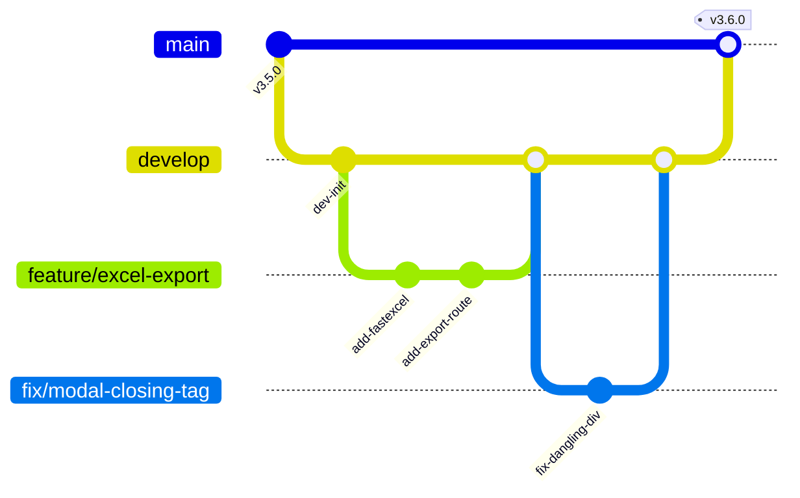

# Panduan Berkontribusi (CONTRIBUTING.md) — Nefakky Marketplace

Terima kasih atas minat Anda untuk berkontribusi pada pengembangan **Nefakky Artisanal Culinary Marketplace**! Dokumen ini memuat panduan, standar penulisan kode, dan etika kolaborasi agar seluruh codebase tetap bersih, konsisten, dan mudah dipelihara.

---

## 1. Kode Etik & Standar Pengembangan

Kami berkomitmen untuk menyediakan lingkungan kolaborasi yang profesional, ramah, dan inklusif. Seluruh kontributor diharapkan mematuhi standar berikut:
* Bersikap saling menghargai dan terbuka terhadap kritik konstruktif.
* Mengutamakan kualitas kode, keamanan data, dan kepuasan pengalaman pengguna (*User Experience*).
* Menjaga integritas dokumentasi dan kelengkapan komentar kode fungsi.

---

## 2. Standar Gaya Penulisan Kode (Coding Guidelines)

### 2.1 Backend Laravel (PHP)
* **Standar PSR**: Wajib mematuhi standar **PSR-12 (Extended Coding Style)** dan **PSR-4 (Autoloading)**.
* **Type Hinting & Return Types**: Gunakan *explicit type declarations* pada seluruh argumen fungsi dan tipe nilai balik (*return types*).
* **Form Requests**: Validasi request mutasi (`POST`, `PUT`) wajib menggunakan class `FormRequest` khusus di `app/Http/Requests/`.
* **API Resources**: Respons data wajib dibungkus menggunakan `JsonResource` di `app/Http/Resources/` untuk konsistensi struktur JSON.
* **Komentar Kode (PHPDoc)**: Setiap class, method, dan event wajib dilengkapi docblock berbahasa Indonesia yang jelas.

### 2.2 Frontend Next.js & React (TypeScript)
* **TypeScript Strict Mode**: Kode harus 100% type-safe. Dilarang menggunakan tipe data implisit `any` tanpa alasan khusus yang terdokumentasi.
* **Komponen & Naming Conventions**:
  * Nama komponen menggunakan format **PascalCase** (contoh: `MenuDetailModal.tsx`, `AdminDashboardTab.tsx`).
  * Nama hooks kustom menggunakan awalan **camelCase** `use` (contoh: `useAuth.ts`, `useCart.ts`).
  * Nama utilitas menggunakan **camelCase** (contoh: `mapService.ts`, `exportUtils.ts`).
* **Styling Tailwind CSS**:
  * Gunakan utility classes Tailwind yang konsisten dengan palet desain Google Stitch Artisanal Luxury.
  * Hindari *inline CSS styles* kecuali untuk nilai dinamis murni (seperti posisi koordinat kanvas).
* **Aksesibilitas (A11y)**: Seluruh tombol ikon wajib menyertakan atribut `aria-label` deskriptif.

---

## 3. Alur Kerja Git & Percabangan (Git Workflow)



### 3.1 Penamaan Cabang (Branch Naming)
* Fitur Baru: `feature/nama-fitur` (contoh: `feature/pdf-invoice-generator`)
* Perbaikan Bug: `fix/nama-bug` (contoh: `fix/cart-stepper-offset`)
* Dokumentasi: `docs/nama-dokumen` (contoh: `docs/api-reference-update`)
* Refactoring: `refactor/nama-modul` (contoh: `refactor/auth-context-cleanup`)

### 3.2 Konvensi Pesan Commit (Conventional Commits)
Gunakan format standar: `<type>(<scope>): <deskripsi singkat berbahasa Indonesia>`
* `feat`: Penambahan fitur baru (contoh: `feat(order): tambahkan ekspor laporan penjualan excel via FastExcel`)
* `fix`: Perbaikan bug atau error (contoh: `fix(cart): perbaiki referensi BagIcon menjadi ShoppingBag`)
* `docs`: Pembaruan dokumentasi (contoh: `docs: perbarui spesifikasi PRD dan database schema`)
* `style`: Perapihan format kode atau UI tanpa mengubah logika (contoh: `style(navbar): sesuaikan padding container header`)
* `refactor`: Refaktorisasi kode untuk peningkatan performa/keterbacaan (contoh: `refactor(context): pisahkan logic cart store ke zustand`)
* `test`: Penambahan atau perbaikan unit test (contoh: `test(auth): tambahkan verifikasi register validation`)

---

## 4. Checklist Sebelum Mengajukan Pull Request (PR)

Sebelum mengajukan Pull Request ke branch `develop` atau `main`, pastikan Anda telah menjalankan verifikasi lokal:

```bash
# 1. Pengecekan tipe TypeScript Frontend
cd f:\UKK\nefakky3
npx tsc --noEmit

# 2. Eksekusi Test Suite Frontend
cd f:\UKK\nefakky3
npm test

# 3. Eksekusi Test Suite Backend Laravel
cd f:\UKK\Laravel
php artisan test

# 4. Validasi Daftar Route Backend
cd f:\UKK\Laravel
php artisan route:list
```

### Kriteria Kelayakan Penggabungan (Merge Criteria):
1. ✅ Seluruh perintah di atas berhasil tanpa galat (`0 errors, 100% tests passed`).
2. ✅ Kode baru telah dilengkapi komentar baris per baris berbahasa Indonesia.
3. ✅ Tidak ada berkas sementara, berkas build (`.next/`, `vendor/`), atau kunci rahasia (`.env`) yang terikutsertakan.
