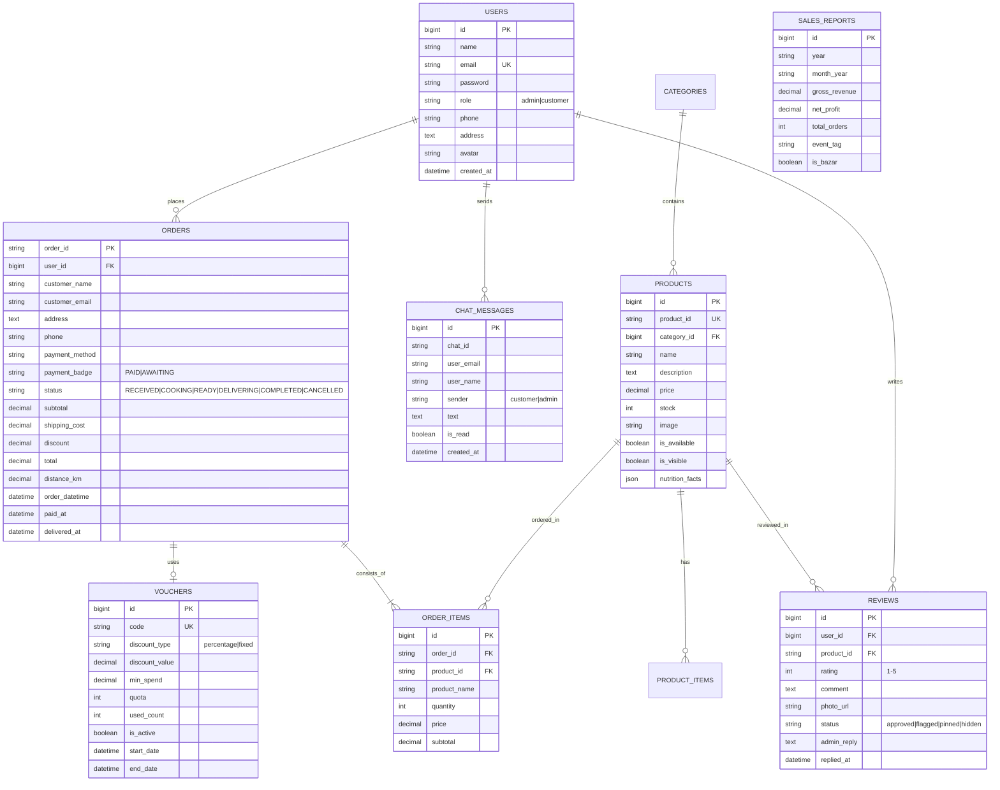

# Skema Basis Data & Relasi (DATABASE.md) — Nefakky Marketplace

**Sistem Manajemen Basis Data**: MySQL 8.0+ / PostgreSQL 15+ / SQLite 3  
**ORM (Object-Relational Mapping)**: Laravel Eloquent ORM  
**Versi Skema**: 3.6.0  
**Penulis**: Tim Pengembang Nefakky (Fatih Ahmad Zakky)  

---

## 1. Diagram Relasi Entitas (Entity-Relationship Diagram / ERD)

---

## 2. Struktur Tabel & Kamus Data

### 2.1 Tabel `users`
Menyimpan data identitas akun pengguna (Pelanggan dan Administrator).
* `id` (`BIGINT UNSIGNED`, PK, Auto-Increment)
* `name` (`VARCHAR(100)`, Not Null): Nama lengkap pengguna.
* `email` (`VARCHAR(150)`, UK, Not Null): Alamat email login.
* `password` (`VARCHAR(255)`, Nullable): Hash Bcrypt (nullable jika login via Google SSO).
* `role` (`ENUM('customer', 'admin')`, Default: `'customer'`): Hak akses sistem.
* `phone` (`VARCHAR(20)`, Nullable): Nomor kontak telepon/WhatsApp.
* `avatar` (`VARCHAR(500)`, Nullable): URL foto profil pengguna.
* `remember_token` (`VARCHAR(100)`, Nullable)
* `created_at`, `updated_at` (`TIMESTAMP`)

---

### 2.2 Tabel `products`
Menyimpan katalog master menu hidangan kuliner artisanal.
* `id` (`BIGINT UNSIGNED`, PK, Auto-Increment)
* `product_id` (`VARCHAR(30)`, UK, Not Null): Identifier unik string (misal: `m1`, `m2`).
* `category_id` (`BIGINT UNSIGNED`, FK, Nullable): Relasi ke tabel `categories`.
* `name` (`VARCHAR(150)`, Not Null): Nama menu masakan.
* `description` (`TEXT`, Nullable): Deskripsi rasa dan rempah.
* `price` (`DECIMAL(12,2)`, Not Null): Harga jual per porsi.
* `stock` (`INT UNSIGNED`, Default: 0): Sisa kuantitas porsi tersedia.
* `image` (`VARCHAR(500)`, Nullable): Path berkas foto menu.
* `is_available` (`BOOLEAN`, Default: true): Status ketersediaan menu.
* `is_visible` (`BOOLEAN`, Default: true): Status tampil di katalog frontend.
* `nutrition_facts` (`JSON`, Nullable): Data kalori, protein, lemak.

---

### 2.3 Tabel `orders`
Menyimpan transaksi pemesanan makanan, status pembayaran, dan logistik kurir.
* `order_id` (`VARCHAR(30)`, PK): Nomor invoice unik (misal: `ORD-88219` atau `NFK-91283`).
* `user_id` (`BIGINT UNSIGNED`, FK, Nullable): Relasi ke tabel `users`.
* `customer_name` (`VARCHAR(100)`, Not Null): Nama penerima pesanan.
* `customer_email` (`VARCHAR(150)`, Not Null): Email pembeli.
* `phone` (`VARCHAR(20)`, Not Null): Nomor telepon pengiriman.
* `address` (`TEXT`, Not Null): Alamat lengkap pengantaran.
* `payment_method` (`VARCHAR(50)`, Not Null): `midtrans_va`, `midtrans_qris`, `cod`.
* `payment_badge` (`ENUM('PAID', 'AWAITING')`, Default: `'AWAITING'`): Status pembayaran.
* `status` (`ENUM('RECEIVED', 'COOKING', 'READY', 'DELIVERING', 'COMPLETED', 'CANCELLED')`, Default: `'RECEIVED'`): Status alur 5-tahap dapur.
* `subtotal` (`DECIMAL(12,2)`, Not Null): Total harga hidangan.
* `shipping_cost` (`DECIMAL(10,2)`, Default: 0.00): Ongkos kirim Haversine.
* `discount` (`DECIMAL(10,2)`, Default: 0.00): Nilai potongan kupon voucher.
* `total` (`DECIMAL(12,2)`, Not Null): Total akhir yang dibayar pelanggan.
* `distance_km` (`DECIMAL(6,2)`, Default: 0.00): Jarak dapur ke alamat dalam Km.
* `voucher_code` (`VARCHAR(50)`, Nullable): Kode voucher yang digunakan.
* `notes` (`TEXT`, Nullable): Catatan khusus rasa / patokan kurir.
* `order_datetime`, `paid_at`, `delivered_at` (`DATETIME`, Nullable)

---

### 2.4 Tabel `order_items`
Menyimpan rincian item hidangan dalam satu nomor pesanan.
* `id` (`BIGINT UNSIGNED`, PK, Auto-Increment)
* `order_id` (`VARCHAR(30)`, FK): Relasi ke tabel `orders`.
* `product_id` (`VARCHAR(30)`, FK): Relasi ke tabel `products`.
* `product_name` (`VARCHAR(150)`, Not Null): Nama produk saat dipesan.
* `quantity` (`INT UNSIGNED`, Not Null): Kuantitas porsi.
* `price` (`DECIMAL(12,2)`, Not Null): Harga satuan saat dipesan.
* `subtotal` (`DECIMAL(12,2)`, Not Null): Total harga item (`quantity * price`).

---

### 2.5 Tabel `vouchers`
Menyimpan aturan kupon promo diskon.
* `id` (`BIGINT UNSIGNED`, PK, Auto-Increment)
* `code` (`VARCHAR(50)`, UK, Not Null): Kode kupon unik (misal: `WEEKENDSERU`).
* `discount_type` (`ENUM('percentage', 'fixed')`, Default: `'percentage'`): Tipe potongan.
* `discount_value` (`DECIMAL(10,2)`, Not Null): Nilai persentase atau nominal rupiah.
* `min_spend` (`DECIMAL(12,2)`, Default: 0.00): Batas minimum belanja.
* `quota` (`INT UNSIGNED`, Default: 100): Kuota total pemakaian.
* `used_count` (`INT UNSIGNED`, Default: 0): Jumlah kupon yang telah diklaim.
* `is_active` (`BOOLEAN`, Default: true): Status aktivasi kupon.
* `start_date`, `end_date` (`DATE`, Nullable): Rentang tanggal berlaku.

---

### 2.6 Tabel `sales_reports`
Menyimpan rekapitulasi data keuangan bulanan dan bazar offline.
* `id` (`BIGINT UNSIGNED`, PK, Auto-Increment)
* `year` (`VARCHAR(10)`, Not Null): Tahun periode (misal: `2026`).
* `month_year` (`VARCHAR(50)`, Not Null): Label bulan (misal: `Agustus 2026 (Live)`).
* `gross_revenue` (`DECIMAL(14,2)`, Default: 0.00): Omset kotor pendapatan.
* `net_profit` (`DECIMAL(14,2)`, Default: 0.00): Margin laba bersih pembukuan.
* `total_orders` (`INT UNSIGNED`, Default: 0): Jumlah pesanan terselesaikan.
* `event_tag` (`VARCHAR(200)`, Nullable): Label bazar / event festival kuliner.
* `is_bazar` (`BOOLEAN`, Default: false): Penanda transaksi bazar kuliner.

---

## 3. Indeks Kinerja Basis Data (Performance Indexes)

Untuk menjamin performa query yang cepat pada lalu lintas tinggi:
1. `orders_customer_email_index`: Mempercepat pencarian riwayat pesanan per pelanggan.
2. `orders_status_index`: Mempercepat filter antrian dapur di dashboard admin.
3. `products_is_visible_category_id_index`: Mempercepat rendering katalog menu aktif.
4. `vouchers_code_is_active_index`: Mempercepat validasi kupon saat checkout.
5. `chat_messages_user_email_index`: Mempercepat loading pesan live chat.
