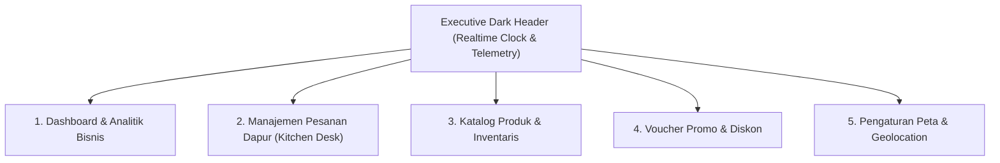

# Spesifikasi Desain Antarmuka: Enterprise Admin Command Center — Nefakky

**Versi Dokumen**: 3.6.0  
**Target Modul**: Administrator, Kitchen Desk, & Operational Command Center (`/admin`)  
**Status**: Production Standard (100% Passed Test Suite & Type-Safe)  
**Penulis**: Tim Pengembang Nefakky (Fatih Ahmad Zakky) & Google Stitch AI Design System  

---

## 1. Arsitektur Tata Letak & Executive Dark Header

* **Latar Belakang & Brand Identity**: Menggunakan skema warna Espresso pekat (`#1A1816`) dengan aksen keemasan (*Warm Gold*) dan tipografi korporat.
* **Header Telemetri Terpadu**:
  - Logo resmi Nefakky Enterprise Command Center.
  - **Jam Kalender Realtime (Realtime Calendar Clock)**: Jam digital berdetak WIB (*Asia/Jakarta*) dengan deteksi otomatis Hari, Tanggal, Bulan, Tahun, Jam, Menit, dan Detik.
  - Badge status koneksi database: *Database Live Connected*.
  - Indikator peringatan transaksi online masuk secara animasi *bounce pop*.

---

## 2. Navigasi 5 Tab Terpadu Command Center

---

## 3. Rincian Modul & Fungsionalitas Tab

### 3.1 Tab 1: Dashboard & Analitik Bisnis (`AdminDashboardTab.tsx`)
* **5 Kartu KPI Eksekutif**:
  1. *Total Omset Kotor*: Akumulasi seluruh pendapatan online dan offline bazar.
  2. *Estimasi Margin Laba Bersih*: Dihitung secara konsisten 40% dari total omset kotor.
  3. *Total Pesanan Berhasil*: Total volume transaksi pesanan yang telah selesai.
  4. *Average Order Value (AOV)*: Nilai rata-rata pengeluaran belanja per 1 transaksi.
  5. *Skor Kepuasan Pelanggan*: Rata-rata skor rating ulasan (4.9 / 5.0).
* **Grafik Penjualan Bulanan Interaktif SVG**:
  - Menampilkan batang grafik omset dari Juni 2026 (Event Bazar >10 Juta) hingga Desember 2026.
  - Batang grafik dapat diklik untuk membuka modal rincian pembukuan bulanan lengkap.
  - Dilengkapi tombol **"Edit Data Grafik"** untuk memodifikasi nominal omset, laba, status bazar, dan catatan bulanan secara langsung.
* **Modal Pencatatan Omset Manual (POS / Bazar Logger)**:
  - Input cepat omset penjualan offline/bazar festival kuliner.
  - Multi-select pill checkboxes untuk menandai menu paling laris (*Best Seller*) dan menu kurang laris.
* **Export Engine Laporan Resmi (`exportUtils.ts`)**:
  - **Ekspor Excel (.xls)**: Menghasilkan spreadsheet resmi berstyling korporat lengkap dengan rumus AOV, margin laba, dan data pesanan.
  - **Ekspor PDF & CSV**: Format cetak laporan ringkas siap audit.

### 3.2 Tab 2: Manajemen Pesanan Dapur (`AdminOrdersTab.tsx`)
* **Alur Status Pesanan 5-Tahap**:
  - `DITERIMA` $\rightarrow$ Pesanan baru masuk dari pelanggan.
  - `DIMASAK` $\rightarrow$ Hidangan sedang diproses di dapur resto.
  - `MENUNGGU KURIR` $\rightarrow$ Makanan selesai dikemas, menunggu penjemputan.
  - `DIANTAR` $\rightarrow$ Kurir meluncur menuju alamat pelanggan.
  - `SELESAI` $\rightarrow$ Pesanan telah diterima pembeli.
* **Fitur Kontrol Operasional**:
  - Tombol pembaruan status 1-klik dengan notifikasi audit log.
  - Label status pembayaran (*LUNAS* via Midtrans atau *MENUNGGU PEMBAYARAN* via COD).
  - Tautan langsung verifikasi kurir WhatsApp: verifikasi foto hidangan dan bukti uang tunai COD kurir.

### 3.3 Tab 3: Katalog Produk & Inventaris (`AdminProductsTab.tsx`)
* Manajemen CRUD 6 Menu Master Hidangan Otentik Nusantara.
* Kontrol harga jual (Rp), persentase diskon promo, stok langsung, kategori hidangan, dan galeri foto.
* Status persediaan visual (*Tersedia / Stok Terbatas / Habis*).

### 3.4 Tab 4: Voucher Promosi & Diskon (`AdminPromotionsTab.tsx`)
* Pembuatan kupon diskon persentase (contoh: 30% diskon).
* Batasan *Minimum Spend* belanja dan batasan total kuota penukaran.
* Validasi masa berlaku tanggal mulai dan tanggal kedaluwarsa kupon otomatis.

### 3.5 Tab 5: Pengaturan Sistem & Peta Geolocation (`AdminSettingsTab.tsx`)
* **Konfigurasi Mesin Peta**:
  - Pilihan beralih antara **OpenStreetMap (Gratis Default Tanpa API Key)** dan **Google Maps (Opsional)**.
  - Pengaturan koordinat pusat Dapur Utama Nefakky (*Bojong Gede, Bogor*).
  - Batas radius pengantaran maksimal (default 25 Km) dan tarif pengiriman per Km (default Rp 2.500).
* **Profil Identitas Resto**: Pengaturan nama resto, nomor telepon operasional, dan alamat resmi.
