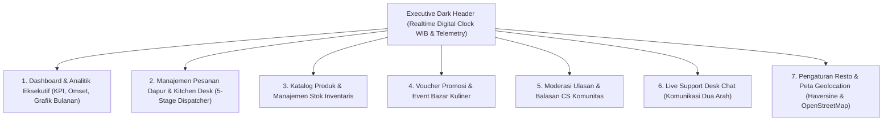

# Spesifikasi Desain Antarmuka: Enterprise Admin Command Center — Nefakky Marketplace

**Versi Dokumen**: 3.6.0  
**Target Modul**: Administrator, Kitchen Desk, Cashier POS, & Operational Command Center (`/admin`)  
**Framework Frontend**: Next.js 14.2 (App Router), Tailwind CSS v3.4, Lucide React, FastExcel, DomPDF, Leaflet, Pusher / Laravel Reverb  
**Status**: Production Standard (100% Passed Test Suite, Type-Safe, WCAG AA Accessible)  
**Penulis**: Tim Pengembang Nefakky & Google Stitch AI Design System  

---

## 1. Arsitektur Tata Letak Command Center

---

## 2. Rincian Desain Antarmuka per Tab Command Center

### 2.1 Executive Dark Header (`AdminHeader.tsx`)
* **Skema Visual**: Background gelap Espresso pekat (`#1A1816`), border emas lembut (`#D97706`), dan teks putih kontras tinggi.
* **Realtime Digital Clock WIB (`Asia/Jakarta`)**:
  * Menampilkan Hari, Tanggal, Bulan, Tahun, serta Jam, Menit, dan Detik yang berdetak secara live tanpa lag.
* **Indikator Telemetri Sistem**:
  * Status Database: *Database Live Connected* (Hijau Emerald).
  * Status WebSocket Reverb: *Realtime Sync Active* (Biru Sky).
  * Notifikasi Pesanan Baru: Animasi badge pop-up dengan nada suara notifikasi lembut.
* **Tab Switcher Cepat**: Navigasi horizontal 7 modul operasional utama.

---

### 2.2 Tab 1: Dashboard & Analitik Bisnis (`AdminDashboardTab.tsx`)
* **5 Kartu Metrik KPI Utama**:
  1. *Total Omset Penjualan (Gross Revenue)*: Akumulasi seluruh pendapatan online dan event bazar.
  2. *Estimasi Laba Bersih (Net Profit)*: Laba bersih dihitung 40-50% dari omset dikurangi HPP bahan baku.
  3. *Total Volume Pesanan*: Jumlah seluruh transaksi berhasil.
  4. *Average Order Value (AOV)*: Nilai rata-rata keranjang per satu transaksi.
  5. *Skor Kepuasan Pelanggan (CSAT)*: Rata-rata bintang ulasan konsumen (4.9 / 5.0).
* **Grafik Penjualan Bulanan Interaktif SVG**:
  * Grafik batang dinamis dari bulan Juni 2026 (Bazar Pembukaan >10 Juta) hingga Desember 2026.
  * Setiap bar grafik dapat diklik untuk membuka modal rincian keuangan per bulan.
  * Tombol **"Edit Data Grafik"** untuk update cepat nilai omset, laba, event tag, dan status bazar.
* **Modal Pencatatan Penjualan Offline (POS / Bazar Logger)**:
  * Input manual transaksi bazar kuliner offline dengan validasi otomatis.
  * Checkbox seleksi hidangan terlaris (*Best Seller*) dan hidangan penunjang.
* **Mesin Ekspor Laporan Keuangan**:
  * **Ekspor Excel (.xlsx)**: Menggunakan `FastExcel` & `exportUtils.ts` menghasilkan lembar kerja rapi dengan formula otomatis.
  * **Ekspor PDF & CSV**: Format cetak ringkasan audit siap kirim.

---

### 2.3 Tab 2: Manajemen Pesanan Dapur (`AdminOrdersTab.tsx`)
* **Dispatcher Status Pesanan 5-Tahap**:
  1. `DITERIMA (RECEIVED)`: Notifikasi pesanan baru masuk antrian dapur.
  2. `DIMASAK (COOKING)`: Chef sedang meracik hidangan di dapur resto.
  3. `MENUNGGU KURIR (READY)`: Makanan telah dikemas rapi, siap dipickup.
  4. `DIANTAR (DELIVERING)`: Kurir sedang dalam perjalanan ke alamat pembeli.
  5. `SELESAI (COMPLETED)`: Pesanan telah diserahkan dan dikonfirmasi pembeli.
* **Fitur Kontrol Cepat 1-Klik**:
  * Tombol majukan status (*Advance Stage*) yang seketika memicu WebSocket broadcast ke layar pembeli.
  * Badge verifikasi pembayaran: *PAID (Lunas via Midtrans)* vs *AWAITING (Bayar Tunai COD)*.
  * Tombol verifikasi WhatsApp kurir: pratinjau foto serah terima dan foto struk pembayaran.
  * Modal cetak invoice resmi PDF langsung dari browser.

---

### 2.4 Tab 3: Katalog Produk & Inventaris (`AdminProductsTab.tsx`)
* **Manajemen CRUD Produk Terpadu**:
  * Penambahan, pengeditan, pengarsipan, dan penghapusan produk hidangan.
  * Pengaturan nama hidangan, deskripsi otentik, harga jual (Rp), kategori, foto, dan badge promo.
  * Kontrol stok langsung (Live Stock Counter) dengan peringatan otomatis saat stok di bawah 5 porsi (*Low Stock Warning*).
  * Toggle visibilitas produk di katalog belanja pembeli.
* **Pengaturan Informasi Nutrisi**:
  * Input kalori (Kkal), lemak, gula, dan protein per porsi.

---

### 2.5 Tab 4: Voucher Promosi & Kupon Diskon (`AdminPromotionsTab.tsx`)
* **Manajemen Kupon Diskon**:
  * Pembuatan kode kupon unik (misal: `NEFAKKYMERDEKA`, `WEEKENDSERU`).
  * Pilihan tipe potongan: Persentase (misal: 30%) atau Nominal Tetap (misal: Rp 15.000).
  * Pengaturan syarat minimum belanja (*Min Spend*) dan kuota pemakaian kupon.
  * Masa berlaku tanggal mulai dan kedaluwarsa otomatis.
* **Banner Promosi Beranda**:
  * Pengaturan gambar banner, judul promo, subjudul, dan tautan aksi.

---

### 2.6 Tab 5: Moderasi Ulasan & Balasan CS (`AdminReviewsTab.tsx`)
* **Feed Moderasi Ulasan Konsumen**:
  * Melihat seluruh ulasan bintang yang dikirimkan oleh pembeli.
  * Filter ulasan berdasarkan rating bintang (Semua, Bintang 5, Bintang 4-1).
  * Tombol balas ulasan resmi dari nama **CS Admin Resto**.
  * Aksi moderasi: *Tampilkan*, *Sembunyikan*, atau *Sematkan (Pin Review)*.

---

### 2.7 Tab 6: Live Support Desk Chat (`AdminLiveChatTab.tsx`)
* **Pusat Komunikasi Dua Arah Realtime**:
  * Daftar ruang obrolan per pelanggan yang diidentifikasi via alamat email.
  * Indikator pesan belum terbaca (*Unread Counter*).
  * Kotak obrolan dengan riwayat pesan kronologis, bubble chat pembeda warna admin vs pelanggan, dan time stamp.
  * Tombol respon cepat (*Quick Response Chips*) untuk pertanyaan umum (jadwal pengiriman, stok menu, konfirmasi alamat).

---

### 2.8 Tab 7: Pengaturan Resto & Peta Geolocation (`AdminSettingsTab.tsx`)
* **Konfigurasi Mesin Peta & Kalkulator Jarak**:
  * Pilihan mode peta: **OpenStreetMap (Default Gratis, Tanpa API Key)** atau **Google Maps**.
  * Penentuan koordinat titik pusat Dapur Utama Nefakky (*Puri Bojong Lestari 1 Blok AF 41, Bojong Gede, Bogor*).
  * Pengaturan radius pengantaran maksimal (default 25 Km) dan tarif dasar ongkir (Rp 10.000 untuk 10 Km pertama + Rp 2.500 per kelipatan 3 Km berikutnya).
* **Profil Identitas Resto**:
  * Nama resmi resto UMKM, nomor WhatsApp CS, jam operasional dapur, dan kebijakan retur/refund.

---

## 3. Palet Warna & Desain Token Admin Command Center

| Komponen | Nilai Token / Hex | Kegunaan |
| :--- | :--- | :--- |
| **Dark Header** | `#1A1816` | Header telemetri dan bilah status eksekutif |
| **Dark Body Background** | `#13110F` | Latar belakang modul analitik gelap |
| **Gold / Amber Accent** | `#F59E0B` / `#D97706` | Aksen tombol aktif, indikator jam digital |
| **Surface Card** | `#262320` | Latar belakang kartu metrik dan container tab |
| **Success Status** | `#10B981` (Emerald) | Status transaksi PAID / Order Selesai |
| **Warning Status** | `#F59E0B` (Amber) | Status Cooking / Low Stock |
| **Danger Status** | `#EF4444` (Rose) | Status Cancelled / Out of Stock |
