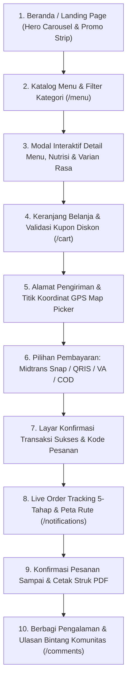

# Spesifikasi Desain Antarmuka: Customer Facing Application — Nefakky Marketplace

**Versi Dokumen**: 3.6.0  
**Target Modul**: Antarmuka Belanja Pelanggan (Beranda, Katalog Menu, Detail & Varian Menu, Cart Checkout Stepper, Live GPS Tracking, Ulasan Rasa, Profil Akun)  
**Framework Frontend**: Next.js 14.2 (App Router), React 18, Tailwind CSS v3.4, Lucide React, Sonner, Framer Motion, Leaflet / OpenStreetMap  
**Status**: Production Standard (100% Passed Test Suite, Type-Safe, WCAG AA Accessible)  
**Penulis**: Tim Pengembang Nefakky & Google Stitch AI Design System  

---

## 1. Alur Perjalanan Pengguna (User Journey Map)

---

## 2. Rincian Desain Antarmuka per Halaman

### 2.1 Beranda Utama (`/`)
* **Bilah Navigasi Terpadu (Navbar)**:
  * Brand wordmark *NEFAKKY* dengan logo monogram serif.
  * Tautan desktop: *Beranda*, *Katalog Menu*, *Ulasan Rasa*, *Status Pesanan*.
  * Indikator keranjang belanja dinamis dengan counter badge kuantitas item.
  * Avatar profil pengguna dengan dropdown aksi cepat dan tombol pintasan Panel Admin (bagi role administrator).
  * Bottom navigation bar 5-kolom simetris untuk perangkat seluler.
* **Hero Showcase Carousel**:
  * Menampilkan hidangan unggulan Nusantara (Ayam Bakar Madu, Gudeg Komplit, Nasi Bakar Cumi) dengan slider otomatis dan kontrol manual interaktif.
  * Tagline editorial berwibawa dengan rating bintang dan jumlah ulasan terverifikasi.
  * Tombol CTA ganda: *Eksplorasi Menu* (primary amber) dan *Lihat Detail* (secondary outline).
* **Floating Category Filter Bar**:
  * Pilihan pill tombol cepat: *Semua*, *Makanan Berat*, *Minuman*, *Menu Hemat*.
* **Active Voucher Promo Strip**:
  * Banner pita promo berjalan yang menampilkan kupon aktif (misal: diskon 30% `WEEKENDSERU`) dengan tombol salin / klaim instan.
* **Katalog Best Seller (6-Grid Card)**:
  * Kartu menu presisi rounded-3xl dengan efek hover zoom halus.
  * Badge terpopuler, harga per porsi, rating bintang, dan kontrol stepper kuantitas keranjang (+/-).
* **Section Filosofi Dapur & Keunggulan Kuliner**:
  * Panel split yang menguraikan komitmen bahan baku rempah alami tanpa pengawet, higienitas pengolahan, dan ketepatan waktu pengiriman.

---

### 2.2 Katalog Menu Lengkap (`/menu`)
* **Sticky Control Bar**:
  * Tab filter kategori dinamis (*Semua*, *Makanan Berat*, *Minuman*, *Menu Hemat*, *Segera Hadir*).
  * Bilah pencarian teks realtime dengan ikon kaca pembesar.
  * Dropdown pengurutan (*Terpopuler*, *Rating Tertinggi*, *Harga Rendah-Tinggi*, *Harga Tinggi-Rendah*).
* **Modal Detail Menu & Informasi Nutrisi (`MenuDetailModal.tsx`)**:
  * Galeri foto hidangan resolusi tinggi dengan badge status.
  * Informasi kalori, protein, lemak, dan estimasi waktu masak.
  * Pilihan tingkat kepedasan (Level 1-5) dan catatan request khusus.
  * Pemilihan varian rasa untuk produk minuman (Mangga Aromanis, Sirsak Madu, Jambu Merah).

---

### 2.3 Alur Checkout 4-Tahap (`/cart`)

#### Tahap 1: Keranjang Belanja (Cart Review)
* Daftar item pesanan lengkap dengan foto thumbnail, nama menu, harga satuan, dan kontrol kuantitas.
* Fitur klaim voucher kupon promo dengan validasi batas minimum transaksi (*Min Spend*).
* Ringkasan biaya otomatis: Subtotal, Potongan Diskon, dan Estimasi Ongkir.

#### Tahap 2: Pengiriman & Catatan Dapur
* Pilihan multi-alamat tersimpan dari akun profil pengguna atau input alamat baru.
* **Peta GPS Picker (`AutoMapPickerModal.tsx`)**:
  * Menggunakan OpenStreetMap / Leaflet untuk memilih titik koordinat presisi.
  * Reverse geocoding otomatis yang mengisi teks alamat lengkap.
* Pilihan label alamat cepat (*Rumah*, *Kantor*, *Apartemen*, *Kos*).
* Dua kolom catatan khusus:
  1. *Catatan Kurir*: Panduan patokan jalan atau warna pagar.
  2. *Catatan Dapur*: Request resep (misal: sambal dipisah, bumbu banyak).

#### Tahap 3: Metode Pembayaran
* **Midtrans Snap Online**: Virtual Account (BCA, BNI, BRI, Mandiri), QRIS (GoPay, ShopeePay, Dana, OVO), Kartu Kredit/Debit.
* **Cash on Delivery (COD)**: Bayar tunai langsung saat kurir menyerahkan pesanan.
* **Simulator Sandbox Midtrans**:
  * Modal konsol payment tester dengan nomor VA riil dan tombol salin.
  * Background polling otomatis memeriksa status transaksi setiap 2.5 detik.

#### Tahap 4: Konfirmasi Pesanan Berhasil
* Menampilkan Order ID resmi (`#NFK-XXXXXX`) dan animasi selebrasi.
* Rincian tagihan lunas dan tautan langsung ke halaman pelacakan status pengiriman.

---

### 2.4 Pelacakan Pesanan & Status Pengiriman (`/notifications`)
* **Pulsing Realtime Countdown Timer**: Estimasi waktu pengantaran hidangan tiba di lokasi pembeli.
* **Stepper Alur 5-Tahap Status**:
  1. `RECEIVED` - Pesanan Diterima & Masuk Antrian
  2. `COOKING` - Sedang Dimasak oleh Chef
  3. `READY` - Makanan Telah Dikemas Rapi
  4. `DELIVERING` - Kurir Menuju Alamat Pengantaran
  5. `COMPLETED` - Pesanan Tiba & Diserahkan
* **Peta Rute GPS Interaktif**:
  * Visualisasi jalur perjalanan kurir dari Dapur Pusat (*Bojong Gede, Bogor*) ke lokasi pembeli.
  * Switcher mode tampilan: *OpenStreetMap Geografis* atau *Ilustrasi Rute Dapur*.
* **Konfirmasi Penerimaan**: Tombol bagi pelanggan untuk mengonfirmasi pesanan telah tiba dengan selamat.
* **Nota Struk Digital**: Modal pratinjau invoice lengkap dengan tombol cetak PDF resmi (`/api/orders/{id}/invoice-pdf`).

---

### 2.5 Ulasan Rasa & Komunitas Pelanggan (`/comments`)
* **Formulir Ulasan Interaktif**:
  * Dropdown pilihan menu hidangan yang pernah dipesan.
  * Rating bintang dinamis (skala 1.0 s/d 5.0) dengan pratinjau bintang pecahan (half star).
  * Kolom deskripsi ulasan pengalaman rasa.
  * Lampiran foto masakan dari galeri perangkat.
* **Feed Ulasan Komunitas**:
  * Kartu ulasan terverifikasi dengan badge bintang, tag nama menu, dan avatar pelanggan.
  * Thread diskusi untuk melihat tanggapan dan balasan resmi dari tim **CS Admin Resto**.

---

### 2.6 Profil Akun & Pusat Bantuan (`/profile`)
* **Banner Profil Utama**:
  * Pengaturan nama, nomor telepon, dan foto avatar.
  * Dukungan 3 sumber foto avatar: Unggah dari Galeri, Kamera Langsung (Webcam Selfie), atau Sinkronisasi Foto Akun Google.
* **Buku Alamat Pengiriman**: Pengelolaan multi-alamat (Tambah, Edit, Hapus, Jadikan Alamat Utama).
* **Live Chat Customer Service**: Layanan chat interaktif langsung ke admin dapur resto dengan quick-reply chips.
* **Riwayat Pesanan**: Tab filter pesanan (*Semua*, *Aktif*, *Selesai*) dengan tombol *Pesan Lagi (Re-order)* dan *Lacak Status*.

---

## 3. Palet Warna & Tipografi Customer Facing

| Elemen | Token Warna / Hex | Kegunaan |
| :--- | :--- | :--- |
| **Primary Base** | `#25160E` (Deep Espresso) | Warna teks judul utama, navbar, tombol primer |
| **Accent Tone** | `#934B19` (Warm Amber) | Warna hover link, aksen tombol aktif, highlight harga |
| **Surface Background** | `#FAF8F5` (Warm Cream) | Warna latar belakang seluruh halaman |
| **Card Surface** | `#FFFFFF` (Pure White) | Warna kartu produk, modal container, form input |
| **Success Indicator** | `#10B981` (Emerald) | Status pembayaran lunas, order completed, voucher valid |
| **Warning Indicator** | `#F59E0B` (Amber) | Status pending cooking, stock low |
| **Font Family** | Sans-serif & Serif Editorial | Font sans untuk keterbacaan data, serif untuk brand & headline |
