# Spesifikasi Desain Antarmuka: Customer Facing Application — Nefakky

**Versi Dokumen**: 3.6.0  
**Target Modul**: Antarmuka Belanja Pelanggan (Beranda, Menu, Cart Checkout, Tracking, Profile)  
**Status**: Production Standard (100% Passed Test Suite & Type-Safe)  
**Penulis**: Tim Pengembang Nefakky (Fatih Ahmad Zakky) & Google Stitch AI Design System  

---

## 1. Alur Belanja & Peta Halaman Pengguna

```mermaid
graph LR
    A["1. Beranda / Landing (Hero)"] --> B["2. Katalog Menu 3-Kategori"]
    B --> C["3. Modal Varian 3-Jus / Detail"]
    C --> D["4. Keranjang Belanja (/cart)"]
    D --> E["5. Input Alamat & GPS Map Picker"]
    E --> F["6. Pembayaran Midtrans Snap / COD"]
    F --> G["7. Layar Pesanan Berhasil"]
    G --> H["8. Live Tracking Rute OpenStreetMap (/notifications)"]
    H --> I["9. Konfirmasi Tiba & Cetak Struk PDF"]
```

---

## 2. Rincian Antarmuka Halaman Pelanggan

### 2.1 Beranda & Hero Showcase (`/`)
* **Hero Banner Utama**: Visual masakan Nusantara artisanal dengan tipografi serif elegan dan tombol cepat *Jelajahi Menu*.
* **Highlight 3 Kategori Cepat**: Akses instan menuju *Makanan Berat*, *Minuman*, dan *Menu Hemat*.
* **Widget Keranjang Melayang (Floating Cart Counter)**: Badge jumlah pesanan interaktif di sudut kanan bawah yang memudahkan akses instan ke keranjang.

### 2.2 Katalog Menu & Detail Produk (`/products` & Modal Menu)
* **Pilihan 3 Kategori Bersih**:
  1. *Makanan Berat*: Ayam Bakar Madu (Rp 35.000), Nasi Bakar Cumi (Rp 10.000), Gudeg Komplit (Rp 10.000).
  2. *Menu Hemat*: Krecek Gurih (Rp 20.000), Garang Asam (Rp 10.000).
  3. *Minuman*: Aneka Jus Segar (Rp 5.000).
* **Modal Varian 3-Jus Interaktif**:
  - Pelanggan dapat memilih antara 3 rasa: **Mangga Aromanis**, **Sirsak Madu**, dan **Jambu Merah**.
  - Setiap pergantian rasa otomatis mengubah galeri foto, komposisi rasa, dan kalori secara instan tanpa perlu memuat ulang halaman.

---

## 3. Alur Checkout 4-Tahap (`/cart`)

### 3.1 Tahap 1: Keranjang Belanja (Cart Review)
* Daftar item pesanan lengkap dengan kontrol kuantitas (+/-) dan tombol hapus cepat.
* Kolom input klaim kupon promo diskon (contoh: kupon `WEEKENDSERU` diskon 30%) dengan validasi *Min Spend*.
* Ringkasan biaya dinamis: Subtotal, Potongan Diskon Promo, dan Tombol Lanjut ke Pengiriman.

### 3.2 Tahap 2: Detail Alamat & Catatan Dapur
* Pemilihan alamat tersimpan dari buku alamat profil atau input alamat baru.
* Tombol **Pilih dari Peta GPS (OpenStreetMap)** untuk menentukan koordinat presisi.
* Chip pilihan label cepat: `Rumah`, `Kantor`, `Apartemen`.
* Dua kolom catatan khusus:
  1. *Catatan Pengantaran*: Panduan rute untuk kurir (misal: patokan gang, warna pagar).
  2. *Catatan Dapur*: Permintaan khusus resep (misal: tidak pedas, sambal dipisah).

### 3.3 Tahap 3: Pembayaran Midtrans Snap & Cash on Delivery (COD)
* Pilihan metode pembayaran:
  - *Virtual Account BCA / BNI / Mandiri* (Midtrans Core API)
  - *QRIS Instant* (Gopay / ShopeePay / Dana / OVO)
  - *Kartu Kredit / Debit Online*
  - *Cash on Delivery (COD)* — Bayar tunai ke kurir saat hidangan tiba.
* Transparansi rincian biaya: Subtotal + Ongkos Kirim Bertingkat Jarak - Diskon = Total Bayar.
* Modal konsol Midtrans Sandbox: Nomor VA riil, tombol salin kode, dan tombol langsung ke simulator Midtrans resmi.
* Radar verifikasi pelunasan otomatis (*background polling*) setiap 2.5 detik.

### 3.4 Tahap 4: Layar Pesanan Berhasil (Order Confirmation)
* Nomor transaksi pesanan resmi: `#NFK-XXXXXX`.
* Indikator status pelunasan (Lunas via Midtrans atau Menunggu Pembayaran COD).
* Tombol navigasi langsung menuju **Live Tracking Rute Pengiriman**.

---

## 4. Pelacakan Rute Pengiriman OpenStreetMap (`/notifications`)

* **Peta Rute OpenStreetMap Interaktif**:
  - Menampilkan jalur rute perjalanan dari Dapur Pusat (*Puri Bojong Lestari, Bogor*) ke Alamat Pembeli.
  - Pin alamat tujuan dan status telemetri kecepatan kurir (~35 km/jam).
* **Mode Switcher**:
  - `[OpenStreetMap]`: Peta jalan geografis interaktif OpenStreetMap.
  - `[Rute Dapur]`: Animasi kurir bergerak di sepanjang kurva jalur pengantaran.
* **Modal Peta Penuh (Full View)**:
  - Tampilan peta layar penuh beresolusi tinggi dengan rincian titik keberangkatan dapur dan profil kurir pengantar.
* **Tombol Konfirmasi Kedatangan**:
  - Tombol **"Konfirmasi Pesanan Telah Sampai (Tiba Tepat Waktu)"** yang seketika memperbarui status transaksi menjadi selesai dan mengirimkan notifikasi ke admin.
* **Nota Struk Digital**:
  - Tombol **Cetak Struk Resmi** format PDF siap cetak (`window.print()`).

---

## 5. Profil Pengguna & 3-Way Photo Studio (`/profile`)

* **3-Way Photo Studio Picker**:
  1. *Unggah Galeri*: Memilih file foto profil dari perangkat pengguna.
  2. *Kamera Langsung*: Mengaktifkan live webcam stream dan menangkap foto via kanvas resolusi tinggi.
  3. *Google SSO Avatar*: Mengembalikan avatar foto akun Google pengguna.
* **Buku Alamat Dinamis**: Menambah, menyunting, dan menghapus alamat pengantaran pelanggan.
