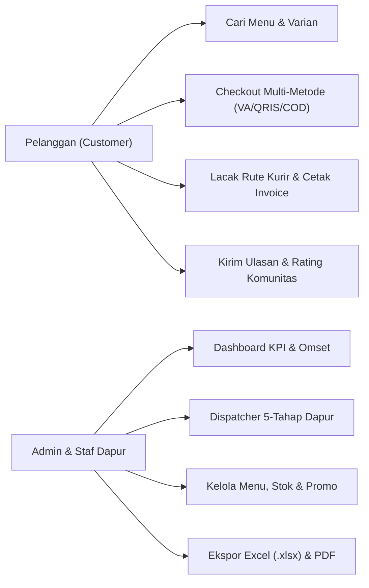

# Product Requirement Document (PRD) — Nefakky Marketplace

**Nama Produk**: Nefakky - Artisanal Food & Culinary Marketplace  
**Versi Dokumen**: 3.6.0  
**Arsitektur Teknologi**: Laravel 12 Main API Backend, Next.js 14.2 App Router Frontend, Laravel Reverb & Pusher WebSockets, Laravel Sanctum Token Auth, Midtrans Snap Gateway & Core API, Dual Map Engine (OpenStreetMap / Google Maps), FastExcel & DomPDF Reporting  
**Status**: Production Ready (100% Passed Test Suite, Type-Safe, WCAG 2.1 AA Compliant)  
**Penulis**: Tim Pengembang Nefakky & Google Stitch AI Design System  

---

## 1. Ringkasan Eksekutif & Latar Belakang

### 1.1 Visi Produk
**Nefakky** adalah platform marketplace kuliner artisanal *Direct-to-Consumer (D2C)* premium yang menyajikan hidangan masakan tradisional rumahan berkualitas tinggi. Platform ini dirancang untuk menghubungkan konsumen penikmat kuliner nusantara dengan dapur resto lokal UMKM secara langsung, transparan, dan tanpa perantara komisi tinggi.

### 1.2 Masalah Bisnis & Solusi yang Dihadirkan
1. **Beban Potongan Komisi Platform Pihak Ketiga (20%-35%)**: Nefakky menghadirkan kanal transaksi direct checkout mandiri sehingga marjin keuntungan UMKM kuliner tetap utuh.
2. **Ketiadaan Transparansi Ongkos Kirim**: Nefakky menggunakan kalkulasi jarak matematis berbasis rumus *Haversine* dengan formula bertingkat transparan ($10\text{rb}/10\text{km} + 2.5\text{rb}/\text{kelipatan }3\text{km}$).
3. **Ketidakpastian Status Pembayaran Online**: Integrasi resmi Midtrans Snap SDK dan Webhook Gateway dengan *background polling* otomatis memvalidasi status pelunasan dalam hitungan detik.
4. **Live Order Tracking Kurir**: Visualisasi peta interaktif rute kurir dari Dapur Utama (*Bojong Gede, Bogor*) ke lokasi pembeli dengan sinkronisasi status 5-tahap melalui WebSocket realtime.

---

## 2. Analisis Pengguna & Persona

### 2.1 Persona Pelanggan (Customer / Food Lover)
* **Kebutuhan**: Memesan makanan secara higienis, melihat informasi kalori dan bahan baku, memilih varian rasa hidangan, melacak lokasi kurir secara visual di peta, dan mengunduh nota transaksi PDF resmi.

### 2.2 Persona Administrator & Tim Dapur (Admin & Kitchen Staff)
* **Kebutuhan**: Memantau grafik penjualan bulanan, memajukan status pesanan secara 1-klik, merespon pesan live chat pembeli, mencatat omset bazar kuliner offline, dan mencetak laporan keuangan.

---

## 3. Spesifikasi Kebutuhan Fungsional (Functional Requirements)

### 3.1 Modul Katalog Menu & Varian Produk (`/menu`)
* **FR-MENU-01**: Menampilkan katalog hidangan dalam 4 kategori (*Makanan Berat*, *Minuman*, *Menu Hemat*, *Segera Hadir*).
* **FR-MENU-02**: Mendukung filter kategori multi-tab, input pencarian teks realtime, dan pengurutan dinamis (Terpopuler, Rating Tertinggi, Harga Terendah/Tertinggi).
* **FR-MENU-03**: Modal rincian produk menyajikan galeri foto, komposisi rempah, tabel nutrisi (kalori, protein, lemak), dan opsi level kepedasan.

### 3.2 Modul Keranjang Belanja & Alur Checkout 4-Tahap (`/cart`)
* **FR-CART-01**: Keranjang belanja mendukung penambahan kuantitas, pengurangan, dan penghapusan item dengan kalkulasi subtotal instan.
* **FR-CART-02**: Validasi kupon promo (*Voucher Engine*) dengan pengecekan batas minimum belanja (*Min Spend*), masa berlaku, dan kuota pemakaian.
* **FR-CART-03**: Modal pemilihan alamat dilengkapi peta GPS OpenStreetMap untuk reverse geocoding koordinat alamat pengiriman.
* **FR-CART-04**: Kalkulator tarif ongkos kirim otomatis berdasarkan formula Haversine:
  $$\text{Ongkir} = \begin{cases} 
  \text{Rp } 10.000 & \text{jika } \text{jarak} \le 10\text{ km} \\ 
  \text{Rp } 10.000 + \left\lceil \dfrac{\text{jarak} - 10}{3} \right\rceil \times \text{Rp } 2.500 & \text{jika } \text{jarak} > 10\text{ km} 
  \end{cases}$$
* **FR-CART-05**: Pilihan metode pembayaran: Midtrans Snap Online (Virtual Account BCA/BNI/Mandiri/BRI, QRIS Instant, Kartu Kredit) dan Cash on Delivery (COD).

### 3.3 Modul Pelacakan Pesanan & Status Pengiriman (`/notifications`)
* **FR-TRK-01**: Stepper status pengiriman 5-tahap: `RECEIVED` $\rightarrow$ `COOKING` $\rightarrow$ `READY` $\rightarrow$ `DELIVERING` $\rightarrow$ `COMPLETED`.
* **FR-TRK-02**: Peta rute pengiriman interaktif berbasis Leaflet / OpenStreetMap dengan telemetri estimasi kurir.
* **FR-TRK-03**: Tombol konfirmasi penerimaan pesanan oleh pelanggan yang otomatis memperbarui status transaksi menjadi selesai.
* **FR-TRK-04**: Unduh nota transaksi dan invoice resmi dalam format PDF (`GET /api/orders/{id}/invoice-pdf`).

### 3.4 Modul Ulasan Rasa & Komunitas (`/comments`)
* **FR-REV-01**: Pengguna dapat mengirimkan ulasan dengan rating bintang (1.0 s/d 5.0), deskripsi rasa, dan lampiran foto hidangan.
* **FR-REV-02**: Menampilkan thread diskusi balasan resmi dari tim CS Admin Resto.

### 3.5 Modul Command Center Administrator (`/admin`)
* **FR-ADM-01**: Dashboard menyajikan 5 metrik KPI eksekutif (Omset Kotor, Estimasi Laba Bersih 40%, Total Pesanan, AOV, dan CSAT Rating).
* **FR-ADM-02**: Grafik interaktif omset bulanan SVG dan modal input penjualan bazar offline (POS Logger).
* **FR-ADM-03**: Manajemen pesanan dapur dengan kontrol 1-klik untuk memajukan status pesanan dan memicu siaran WebSocket realtime.
* **FR-ADM-04**: Manajemen katalog produk (CRUD, live stock counter, low stock alert, dan toggle visibilitas).
* **FR-ADM-05**: Generator kupon diskon promo dan pengaturan masa berlaku voucher.
* **FR-ADM-06**: Ekspor laporan keuangan ke format spreadsheet Excel (.xlsx via FastExcel) dan PDF.

---

## 4. Kebutuhan Non-Fungsional (Non-Functional Requirements)

* **NFR-PERF (Performa)**: Waktu muat halaman pertama (*First Contentful Paint*) $< 1.0$ detik pada koneksi 4G standar.
* **NFR-SEC (Keamanan)**:
  * Otentikasi API menggunakan Laravel Sanctum Bearer Token.
  * Server key Midtrans disimpan aman pada environment variable sisi backend.
  * Proteksi CSRF Cookie pada seluruh endpoint form mutasi.
* **NFR-REL (Keandalan Realtime)**: Event broadcast menggunakan WebSocket Laravel Reverb dengan fallback graceful ke polling saat offline.
* **NFR-TYP (Integritas Tipe)**: 100% kepatuhan TypeScript Strict Mode (`0 error` pada `npx tsc --noEmit`).
* **NFR-A11Y (Aksesibilitas)**: Memenuhi standar WCAG 2.1 Level AA dengan kontras warna memadai dan navigasi keyboard lengkap.
