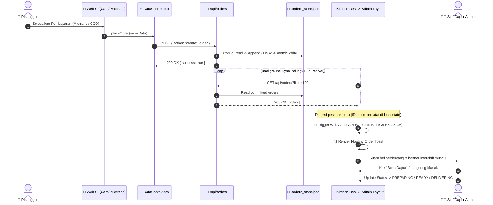

# 🍲 Nefakky — Artisanal Culinary Marketplace & Enterprise Operations Platform

[](docs/CHANGELOG.md)
[](https://nextjs.org/)
[](https://reactjs.org/)
[](https://www.typescriptlang.org/)
[](https://tailwindcss.com/)
[](src/components/icons/CustomIcons.tsx)
[](src/context/DataContext.tsx)
[](src/app/admin/chat/page.tsx)
[](https://midtrans.com/)
[-success?style=for-the-badge)](docs/TEST_REPORT.md)

---

## 📖 Ringkasan Eksekutif & Gambaran Umum

**Nefakky** adalah platform *artisanal e-commerce* dan marketplace kuliner terpadu yang dirancang khusus untuk menyajikan hidangan autentik khas nusantara secara higienis, transparan, dan akuntabel.

Aplikasi ini menolak estetika generic buatan template AI (*Anti-AI-Slop*) dengan mengusung **33 ikon kustom buatan manusia** yang di-render melalui teknik CSS mask vektor (`mask-image: url(...)` + `bg-current`), dipadukan dengan tipografi modern Google Fonts Outfit, sistem pelacakan pesanan 5-tahap sekuensial, integrasi kamera langsung untuk bukti pengantaran kurir (*Live Camera Snapshot Proof-of-Delivery*), perhitungan ongkos kirim berbasis koordinat GPS riil (*Haversine Distance Formula*), pembayaran digital Midtrans Snap & Tunai COD, serta modul **Enterprise Admin Command Studio** dengan fitur tutup buku tahunan otomatis dan ekspor laporan resmi **Excel (.xlsx)** & **PDF**.

### 🌟 Pembaruan Utama Rilis v4.8.0
1. **Centralized Orders API & Cross-Incognito Kitchen Desk Sync**:
   - Transaksi pembayaran online via Midtrans atau COD kini langsung didistribusikan ke server store terpusat (`/api/orders` & `.orders_store.json`).
   - Halaman Admin Kitchen Desk mendengarkan pesanan masuk secara lintas-jendela dan mode penyamaran (*incognito*) via background polling 1.5s dan `visibilitychange` listener.
   - Dilengkapi synthesizer hardware **Web Audio API** (akord harmonik 4-nada C5-E5-G5-C6) dan **Floating Realtime Alert Toast** interaktif dengan tombol navigasi 1-klik menuju Dapur.
2. **100% Manual CS Live Chat Desk**:
   - Seluruh percakapan pelanggan dikelola secara murni oleh staf manusia di dapur pusat tanpa bot otomatis generic.
   - Didukung sinkronisasi realtime multi-jendela melalui `/api/chat` dan status baca pesan (*read/unread indicator*).
3. **Mesin Integritas & Normalisasi Voucher**:
   - Algoritma sanitasi `cleanPromoCode` yang membersihkan spasi tak kasat mata dan menyeragamkan uppercase.
   - Sistem auto-reset siklus minggu ISO (`nefakky_used_vouchers_week`) yang mencegah diskon ganda dalam satu checkout.
4. **Automated Test Suite (11/11 Passed)**:
   - Verifikasi otomatis seluruh modul aplikasi (`npm test`) dengan cakupan typecheck, route integrity, katalog produk, kalkulasi diskon, ongkir GPS Haversine, timezone WIB, dan deduplikasi voucher.

---

## 📚 Indeks Dokumentasi Lengkap Proyek (`/docs`)

Seluruh arsitektur teknis, diagram alur, dan spesifikasi sistem terdokumentasi lengkap pada direktori [`docs/`](docs/):

| Dokumen | Versi | Deskripsi & Cakupan Detail |
| :--- | :---: | :--- |
| 📋 **[PRD.md](docs/PRD.md)** | `v4.8.0` | Product Requirement Document: visi bisnis, user personas, spesifikasi fungsional, arsitektur sinkronisasi pesanan dapur, dan benchmark non-fungsional. |
| 🎨 **[DESIGN.md](docs/DESIGN.md)** | `v4.8.0` | Master Design System: arsitektur 33 ikon kustom Anti-AI-slop, token warna, tipografi Outfit, profil Web Audio API, dan floating alert toast tokens. |
| 🛒 **[DESIGN_USER.md](docs/DESIGN_USER.md)** | `v4.8.0` | Spesifikasi UI/UX antarmuka pelanggan (Beranda, Menu, Cart, Tracking 5-tahap, Ulasan Rasa, Manual CS Chat, dan responsivitas mobile). |
| 🏢 **[DESIGN_ADMIN.md](docs/DESIGN_ADMIN.md)** | `v4.8.0` | Spesifikasi UI/UX Enterprise Admin Command Studio (Dashboard KPI, Kitchen Desk Dispatcher, Live Camera POD, CS Live Desk, POS Logger). |
| 🏗️ **[ARCHITECTURE.md](docs/ARCHITECTURE.md)** | `v4.8.0` | Arsitektur sistem multi-tier: Next.js 14 App Router, DataContext engine, Server File Stores, Web Audio API synthesizers, dan deduplikasi voucher. |
| 📡 **[API.md](docs/API.md)** | `v4.8.0` | Spesifikasi endpoint RESTful API: `/api/orders`, `/api/chat`, webhook Midtrans Snap, payload JSON, dan protokol sinkronisasi. |
| 🗄️ **[DATABASE.md](docs/DATABASE.md)** | `v4.8.0` | Skema basis data terpadu: `.orders_store.json`, `.chat_store.json`, LWW conflict resolution, tombstone tracking, dan sinkronisasi browser. |
| 🔄 **[WORKFLOW.md](docs/WORKFLOW.md)** | `v4.8.0` | Alur kerja bisnis: siklus hidup pesanan 5-tahap, mitigasi lonjakan High Demand, alur chat manual 100% human-operated, dan klaim voucher. |
| 💻 **[INSTALLATION.md](docs/INSTALLATION.md)** | `v4.8.0` | Panduan instalasi dan setup lokal: Zero-Configuration JSON stores, integrasi Midtrans Sandbox, asset generator, dan execution checklist. |
| 🧪 **[TEST_REPORT.md](docs/TEST_REPORT.md)** | `v4.8.0` | Laporan pengujian otomatis `npm test`: 11/11 tes lulus 100%, verifikasi isolasi varian, timezone WIB, dan deduplikasi voucher. |
| 📜 **[CHANGELOG.md](docs/CHANGELOG.md)** | `v4.8.0` | Catatan riwayat versi detail dari rilis v1.0.0 hingga pembaruan arsitektural v4.8.0. |
| 🤝 **[CONTRIBUTING.md](docs/CONTRIBUTING.md)** | `v4.8.0` | Panduan kontribusi, standard code style TypeScript, protokol validasi `npm test`, dan arsitektur server store routes. |

---

## 🏗️ Arsitektur Aliran Data Pesanan Realtime


```mermaid
sequenceDiagram
    autonumber
    actor Customer as 👤 Pelanggan
    participant UI as 📱 Web UI (Cart / Midtrans)
    participant DataContext as ⚡ DataContext.tsx
    participant OrdersAPI as 📡 /api/orders
    participant Store as 💾 .orders_store.json
    participant AdminUI as 🍳 Kitchen Desk & Admin Layout
    actor KitchenStaff as 👨‍🍳 Staf Dapur Admin

    Customer->>UI: Selesaikan Pembayaran (Midtrans / COD)
    UI->>DataContext: placeOrder(orderData)
    DataContext->>OrdersAPI: POST { action: "create", order }
    OrdersAPI->>Store: Atomic Read -> Append / LWW -> Atomic Write
    OrdersAPI-->>DataContext: 200 OK { success: true }
    
    loop Background Sync Polling (1.5s Interval)
        AdminUI->>OrdersAPI: GET /api/orders?limit=100
        OrdersAPI->>Store: Read committed orders
        OrdersAPI-->>AdminUI: 200 OK [orders]
    end

    Note over AdminUI: Deteksi pesanan baru (ID belum tercatat di local state)
    AdminUI->>AdminUI: 🔔 Trigger Web Audio API Harmonic Bell (C5-E5-G5-C6)
    AdminUI->>AdminUI: 🪟 Render Floating Order Toast
    AdminUI-->>KitchenStaff: Suara bel berdentang & banner interaktif muncul
    KitchenStaff->>AdminUI: Klik "Buka Dapur" / Langsung Masak
    KitchenStaff->>AdminUI: Update Status -> PREPARING / READY / DELIVERING
```

---

## 🚀 Fitur Unggulan Platform

### 🛒 1. Modul Pelanggan (Customer Experience)
* **Arsitektur Ikon Kustom Anti-AI-Slop**: 100% bebas dari emoji 3D kartun dan ikon template generic; didukung 33 ikon vektor presisi buatan tangan.
* **Single Active Order Protection**: Mencegah pemesanan ganda tumpang tindih dengan mengunci checkout baru sebelum pesanan aktif selesai atau dikonfirmasi.
* **Katalog Hidangan & Varian Sambal/Minuman**: Menampilkan informasi gizi (kalori, protein, lemak), komposisi rempah, opsi kepedasan, dan variasi es/gula terisolasi aman.
* **Perhitungan Ongkir GPS Haversine**: Penentuan titik koordinat via peta interaktif dengan rumus jarak lengkung bola bumi presisi (flat Rp10.000 ≤10 km, +Rp2.500/2 km).
* **Pembayaran Ganda Terintegrasi**: QRIS, GoPay, ShopeePay, Virtual Account Bank via Midtrans Snap Sandbox, serta Cash on Delivery (COD).
* **Pelacakan Pesanan 5-Tahap Realtime**: Telemetri tahapan `RECEIVED` $\rightarrow$ `PREPARING` $\rightarrow$ `READY` $\rightarrow$ `DELIVERING` $\rightarrow$ `DELIVERED` dengan alert lonjakan jam sibuk (*High Demand*).
* **Ulasan Komunitas & Rating Emas**: Mengunggah foto masakan riil via kamera atau galeri dengan rating bintang 1–5 dan komentar bahasa Indonesia alami.
* **CS Live Chat Instan (100% Human)**: Obrolan dua arah langsung dengan staf dapur restoran tanpa bot otomatis.

### 🏢 2. Modul Admin Command Studio (`/admin`)
* **Kitchen Desk 5-Tahap Realtime Dispatcher**:
  - Deteksi instan pesanan masuk lintas-tab dan mode incognito dalam ≤1.5 detik.
  - Sintesis audio bel harmonik 4-akor hardware Web Audio API tanpa file audio eksternal.
  - Floating Alert Toast interaktif dengan counter total item dan navigasi 1-klik.
* **Live Camera Snapshot POD (Proof of Delivery)**:
  - Pengambilan foto bukti serah terima kurir langsung melalui webcam atau kamera perangkat tanpa upload manual.
* **Manual CS Live Desk (`/admin/chat`)**:
  - Antarmuka obrolan berpusat pada staf manusia untuk melayani konsultasi pesanan, kendala pengantaran, dan permintaan khusus.
* **Dashboard Analitik & Visualisasi KPI**:
  - Ringkasan omset kotor, estimasi laba bersih 40%, volume pesanan, dan tren harian.
* **Cetak Struk Kasir POS Thermal**:
  - Format nota cetak struk kasir 58mm / 80mm standar POS lengkap dengan rincian hidangan, pajak, ongkir, dan barcode.
* **Katalog Produk & Kontrol Stok**:
  - Saklar instan *In-Stock* / *Sold-Out* untuk mencegah pemesanan hidangan saat bahan baku habis.
* **Voucher Builder & Deduplication**:
  - Pembuat kode promo dengan batas minimum belanja, persentase diskon, dan proteksi klaim ganda.
* **Pengaturan Resto & Tutup Buku Tahunan**:
  - Konfigurasi koordinat GPS Central Kitchen, saklar darurat *High Demand*, dan ekspor laporan keuangan tahunan ke format **Excel (.xlsx)** dan **PDF**.

---

## ⚡ Panduan Cepat Menjalankan Proyek

```bash
# 1. Masuk ke direktori proyek
cd f:\UKK\nefakky3

# 2. Pasang seluruh dependensi NPM
npm install

# 3. Generate 33 aset ikon kustom vektor
npm run icons

# 4. Jalankan rangkaian automated test suite (wajib 11/11 passed)
npm test

# 5. Jalankan server pengembangan Next.js
npm run dev
```

Buka peramban di: **`http://localhost:3000`**  
Kredensial Admin Demo: `admin@nefakky.com` / `admin123`  
URL Admin Dapur: **`http://localhost:3000/admin/orders`**  
URL Admin Live Chat: **`http://localhost:3000/admin/chat`**

---

## 🧪 Status Pengujian Otomatis

Rangkaian tes otomatis memastikan stabilitas fungsional dan integritas tipe data:

```bash
npm test
```

```text
==============================================
 Status Pengujian: PASSED ✅
 Total: 11 | Passed: 11 | Failed: 0
 Laporan telah diperbarui di: docs/TEST_REPORT.md
==============================================
```

Lihat detail pengujian lengkap di [docs/TEST_REPORT.md](docs/TEST_REPORT.md).

---

## 📜 Lisensi & Hak Cipta

Dikembangkan oleh **Tim Rekayasa Nefakky** untuk Uji Kompetensi Keahlian (UKK) Rekayasa Perangkat Lunak. Seluruh hak cipta dilindungi undang-undang.
