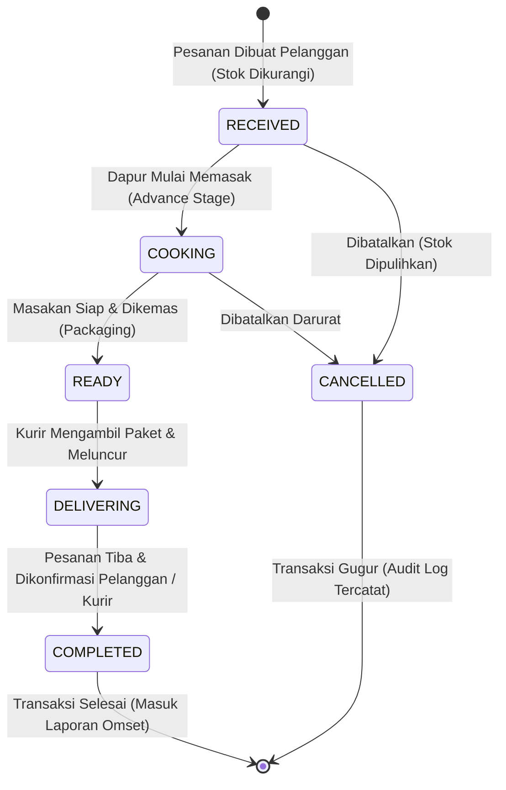
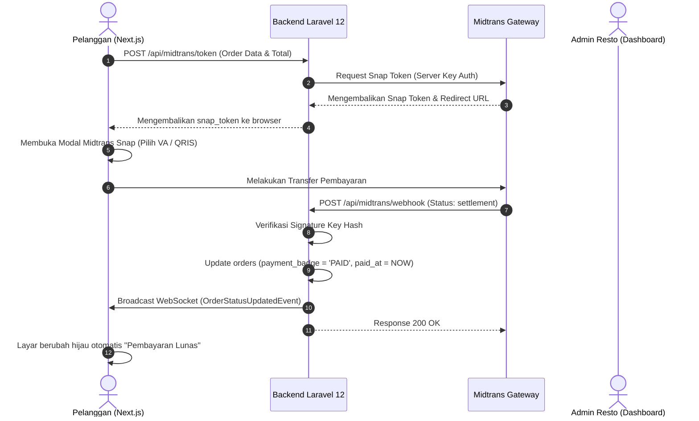

# Alur Kerja Bisnis & Operasional (WORKFLOW.md) — Nefakky Marketplace

**Versi Dokumen**: 3.6.0  
**Target Modul**: Alur Hidup Pesanan (Order Lifecycle), State Machine 5-Tahap Dapur, Webhook Gateway Pembayaran, Pemulihan Stok (ACID Rollback), dan Siklus Rekapitulasi Keuangan.  
**Penulis**: Tim Pengembang Nefakky (Fatih Ahmad Zakky)  

---

## 1. Alur Transaksi & State Machine Pesanan 5-Tahap

Setiap transaksi pesanan makanan di Nefakky melalui mesin status (*State Machine*) terstruktur yang menjamin keteraturan operasional dapur dan transparansi pelacakan bagi pelanggan.



---

## 2. Rincian 5 Tahapan Alur Kerja Dapur

### Tahap 1: `RECEIVED` (Pesanan Diterima Dapur)
* **Pemicu**: Pelanggan menekan tombol "Konfirmasi Pesanan" di `/cart`.
* **Proses Sistem**:
  1. Memvalidasi ketersediaan stok setiap item menu (`stock >= quantity`).
  2. Mengunci baris database via transaksi ACID (`DB::transaction`) dan mengurangi kuantitas stok produk secara atomik.
  3. Menerbitkan nomor invoice unik (`ORD-XXXXX` atau `NFK-XXXXX`).
  4. Memicu siaran WebSocket `OrderPlacedEvent` ke channel publik `orders` dan `activity-feed`.
  5. Menampilkan lonceng notifikasi dan pop-up transaksi masuk di layar Admin Kitchen Desk.

### Tahap 2: `COOKING` (Sedang Dimasak Chef)
* **Pemicu**: Admin / Kitchen staff menekan tombol **"Mulai Masak"** di Admin Orders Tab.
* **Proses Sistem**:
  1. Status pesanan diperbarui menjadi `COOKING`.
  2. Memicu broadcast `OrderStatusUpdatedEvent` ke channel privat `orders.{id}`.
  3. Layar pelacakan pelanggan (`/notifications`) mengaktifkan animasi kompor memasak dan estimasi waktu masak.

### Tahap 3: `READY` (Makanan Siap & Dikemas Rapi)
* **Pemicu**: Chef menyelesaikan hidangan dan menekan tombol **"Makanan Siap"**.
* **Proses Sistem**:
  1. Status diperbarui menjadi `READY`.
  2. Memicu notifikasi persiapan kurir penjemputan paket.
  3. Menampilkan status "Menunggu Kurir" pada stepper pelacakan pembeli.

### Tahap 4: `DELIVERING` (Dalam Pengantaran Kurir)
* **Pemicu**: Kurir mengambil paket pesanan dan admin menekan tombol **"Kirim Kurir"**.
* **Proses Sistem**:
  1. Status diperbarui menjadi `DELIVERING`.
  2. Mengaktifkan peta rute interaktif OpenStreetMap di layar pembeli dengan simulasi pergerakan titik kurir menuju alamat tujuan.
  3. Mengaktifkan estimasi waktu tiba (ETA) berhitung mundur (*countdown timer*).

### Tahap 5: `COMPLETED` (Pesanan Selesai & Diterima)
* **Pemicu**: Pelanggan menekan tombol **"Konfirmasi Pesanan Telah Sampai"** atau kurir mengunggah bukti serah terima.
* **Proses Sistem**:
  1. Status diperbarui menjadi `COMPLETED` dan kolom `delivered_at` diisi timestamp waktu saat itu.
  2. Jika metode pembayaran adalah COD, admin menandai `payment_badge = 'PAID'`.
  3. Memicu efek selebrasi konfeti pada antarmuka pelanggan dan membuka opsi untuk mencetak invoice PDF serta mengirimkan ulasan rasa.
  4. Nilai transaksi otomatis terakumulasi ke dalam metrik dashboard omset penjualan.

---

## 3. Alur Pembayaran Digital & Webhook Midtrans



---

## 4. Alur Pembatalan Pesanan & Pemulihan Stok (Rollback Engine)

Jika pesanan dibatalkan karena pembeli membatalkan atau dapur kehabisan bahan darurat:
1. Endpoint `POST /api/orders/{id}/cancel` dieksekusi.
2. Controller menjalankan transaksi database terisolasi:
   ```php
   DB::transaction(function () use ($order) {
       foreach ($order->items as $item) {
           Product::where('product_id', $item->product_id)->increment('stock', $item->quantity);
           // Memicu siaran WebSocket stok produk pulih
           broadcast(new ProductStockUpdatedEvent($item->product_id, $newStock));
       }
       $order->update(['status' => 'CANCELLED']);
   });
   ```
3. Kuantitas stok di katalog belanja pelanggan seketika bertambah kembali tanpa jeda.

---

## 5. Alur Pembukuan & Laporan Keuangan Bulanan

1. Setiap pesanan berstatus `COMPLETED` dan `PAID` menyumbangkan nilai ke omset kotor (*Gross Revenue*).
2. Estimasi laba bersih dihitung secara konsisten $40\% - 50\%$ setelah dikurangi HPP bahan baku dapur.
3. Admin dapat menambahkan pencatatan transaksi offline/bazar festival kuliner via modul **POS Logger**.
4. Laporan dapat diekspor sewaktu-waktu ke berkas spreadsheet resmi Microsoft Excel (.xlsx) menggunakan `FastExcel` melalui tombol **"Unduh Excel (.xlsx)"** pada endpoint `GET /api/reports/sales/export-excel`.
