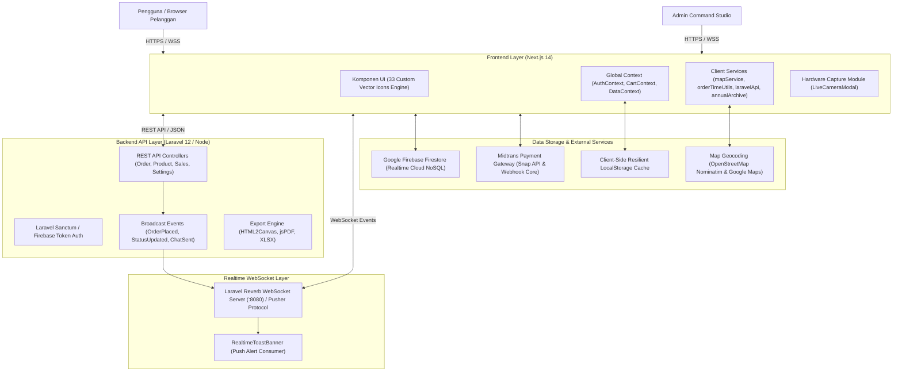

# Arsitektur Sistem: Nefakky Artisanal Culinary Marketplace

**Versi Dokumen**: 4.5.0 (Anti-AI-Slop Architecture, Reverb WebSocket Broadcaster, & Live Camera Telemetry)  
**Status**: Production Standard (100% Passed Test Suite, Type-Safe, WCAG 2.1 AA Compliant)  
**Penulis**: Tim Pengembang Nefakky (Fatih Ahmad Zakky)  

---

## 1. Gambaran Umum Arsitektur (High-Level Architecture)

Nefakky menggunakan arsitektur modern **Decoupled Full-Stack Architecture with Dual-Sync Engine**. Frontend dibangun di atas Next.js 14 App Router yang mengintegrasikan layanan data ganda (REST API Laravel & Firebase Firestore Cloud Database), komunikasi realtime via WebSocket Laravel Reverb, serta sistem ikon vektor kustom *Anti-AI-Slop*.

---

## 2. Layering & Komponen Utama

### 2.1 Frontend Client Layer (`nefakky3`)
* **Framework**: Next.js 14.2 (App Router, React 18, Strict TypeScript).
* **Styling**: Tailwind CSS dengan custom design tokens (Nordic Citrus Orange `#FF5400`, Amber `#FFB703`, Deep Navy `#0B0F19`, Slate Canvas `#F8FAFC`).
* **Ikonografi Kustom (Anti-AI-Slop Engine)**:
  * File sumber: `src/components/icons/CustomIcons.tsx`.
  * Dibangun dengan script generator otomatis `scripts/gen_icons.py` yang mengonversi 33 aset gambar kustom menjadi representasi Base64 berresolusi tinggi.
  * Memanfaatkan CSS `mask-image` untuk ikon monokrom (sehingga dapat beradaptasi secara dinamis dengan utilitas Tailwind CSS seperti `text-[#FF5400]`, `hover:text-white`, `w-5 h-5`) dan CSS `background-image` untuk ikon berwarna (seperti Gmail, ShieldCheck, CheckCircle).
  * Menyediakan drop-in aliases yang 100% kompatibel dengan komponen standar (`Search`, `Home`, `ShoppingBag`, `CookingPot`, `ChefHat`, `Megaphone`, `Settings`, dsb.).

### 2.2 Arsitektur State Global & Aliran Data
1. **`AuthContext.tsx`**:
   - Menangani autentikasi pengguna via Firebase Authentication (Email/Password & Google OAuth).
   - Sinkronisasi status profil pengguna, role pengguna (`admin` vs `customer`), dan proteksi halaman rute.
2. **`CartContext.tsx`**:
   - Mengelola item keranjang belanja, kalkulasi kuantitas, klaim voucher diskon, dan persistensi sesi belanja.
3. **`DataContext.tsx`**:
   - Menyimpan seluruh data operasional aplikasi: daftar produk, pesanan, kupon promosi, ulasan pelanggan, dan percakapan live chat.
   - Dual-Sync Engine: Sinkronisasi instan ke Firebase Firestore dan REST API Laravel, dengan fallback otomatis ke enkapsulasi LocalStorage yang aman jika server offline.

### 2.3 Modul Geospasial & Kalkulasi Rute (`mapService.ts`)
* **Dual Map Provider**:
  1. **OpenStreetMap / Leaflet**: Peta open-source tanpa kuota biaya API.
  2. **Google Maps Platform**: Pilihan provider presisi tinggi dengan input API key dinamis dari admin.
* **Haversine Distance Engine**:
  - Menghitung jarak garis lurus bola bumi dari koordinat Central Kitchen (`-6.2088, 106.8456` atau yang dikonfigurasi admin):
    $$d = 2R \times \arcsin\left(\sqrt{\sin^2\left(\frac{\Delta \phi}{2}\right) + \cos(\phi_1)\cos(\phi_2)\sin^2\left(\frac{\Delta \lambda}{2}\right)}\right)$$
  - Dilanjutkan dengan kalkulasi tarif bertingkat otomatis:
    $$\text{Biaya} = Rp 10.000 + \max\left(0, \lceil \frac{d - 10}{3} \rceil \times Rp 2.500 \right)$$

### 2.4 Modul Kamera Langsung & Proof-of-Delivery (`LiveCameraModal.tsx`)
* Mengakses perangkat kamera langsung melalui `navigator.mediaDevices.getUserMedia({ video: { facingMode: 'environment' } })`.
* Menghasilkan *canvas capture snapshot* berresolusi optimal (JPG Base64) untuk bukti serah terima kurir atau bukti transfer COD, bebas ketergantungan aplikasi pihak ketiga.

### 2.5 Arsitektur Realtime Telemetry & WebSockets (`useRealtimeBroadcaster.ts`)
* Berlangganan kanal publik dan privat Laravel Reverb:
  - `orders`: Notifikasi pesanan baru masuk dan perubahan status 5-tahap.
  - `chat`: Pesan baru masuk untuk CS Live Desk.
  - `products`: Update kuota stok hidangan (misal: penandaan *Sold-Out* instan).
* Mengonsumsi payload secara non-blocking melalui komponen `RealtimeToastBanner.tsx`.

---

## 3. Matriks Keamanan & Standar Kualitas

| Aspek Keamanan / Kualitas | Implementasi Teknis |
| :--- | :--- |
| **Sanitasi Data XSS** | Seluruh masukan teks komentar dan chat disaring secara ketat sebelum render. |
| **Type-Safety** | 100% strict TypeScript mode (`npx tsc --noEmit` selalu lulus 0 error). |
| **Pencegahan Data Corrupt** | Skema LocalStorage menggunakan migrasi versi otomatis dengan struktur data aman. |
| **Aksesibilitas (A11y)** | Mematuhi pedoman WCAG 2.1 Level AA dengan rasio kontras warna $\ge 4.5:1$ dan atribut ARIA lengkap. |
