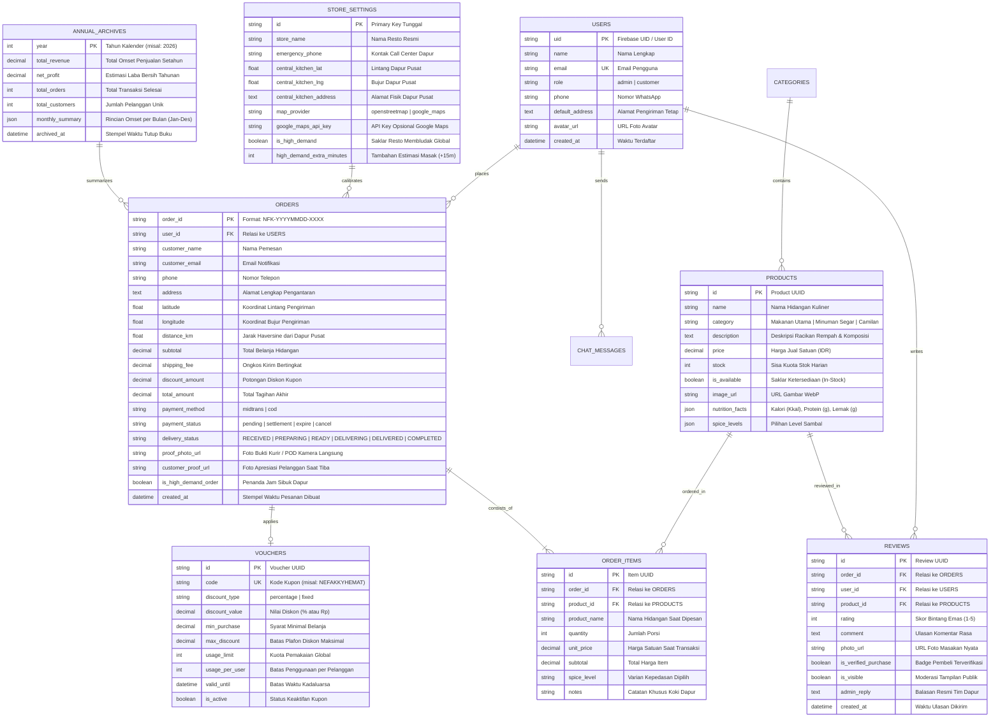

# Skema Basis Data & Desain Relasi — Nefakky Marketplace

**Sistem Manajemen Basis Data**: Dual-Storage Architecture (MySQL 8.0+ / SQLite untuk Laravel Backend, Google Firebase Firestore untuk Sinkronisasi Realtime Cloud, serta LocalStorage Resilient Enkapsulasi Klien)  
**Versi Skema**: 4.5.0 (Updated September 2026 — 5-Stage Kitchen POS, High Demand Telemetry & Annual Archive)  
**ORM / Data Driver**: Laravel Eloquent ORM & Firebase Web SDK v10+  

---

## 1. Diagram Relasi Entitas (Entity-Relationship Diagram / ERD)

---

## 2. Koleksi Firebase Firestore (NoSQL Cloud Architecture)

Dalam implementasi frontend web Next.js (`DataContext.tsx`), struktur dokumen Firestore diorganisasikan ke dalam koleksi terisolasi:

1. **`products`**:
   - Berisi katalog hidangan kuliner, stok bahan, nilai nutrisi, dan saklar ketersediaan.
2. **`orders`**:
   - Berisi rekam jejak pesanan, status alur 5-tahap, foto bukti serah terima kurir, dan riwayat pembayaran Midtrans.
3. **`vouchers`**:
   - Berisi kupon promosi aktif beserta batasan minimum belanja dan tanggal kadaluarsa.
4. **`reviews`**:
   - Berisi testimoni komunitas, rating bintang, dan lampiran foto sajian.
5. **`chatMessages`**:
   - Berisi percakapan live chat antara akun pengguna dan meja operator CS.
6. **`storeSettings`**:
   - Berisi koordinat GPS Central Kitchen, provider peta aktif, dan status darurat *High Demand*.

---

## 3. Strategi Indexing & Optimasi Query

Untuk menjamin kueri cepat tanpa hambatan:
* **Composite Index**:
  - `orders`: `user_id` ASC + `created_at` DESC (untuk mengambil riwayat pesanan pengguna secara instan).
  - `orders`: `delivery_status` ASC + `created_at` ASC (untuk antrean dapur FIFO).
  - `reviews`: `product_id` ASC + `is_visible` ASC + `created_at` DESC (untuk render tab review menu).
* **Tabular Numbers Format**:
  - Seluruh kolom moneter disimpan dalam format integer atau float tanpa desimal pembulatan untuk menjaga akurasi perhitungan laporan keuangan.
