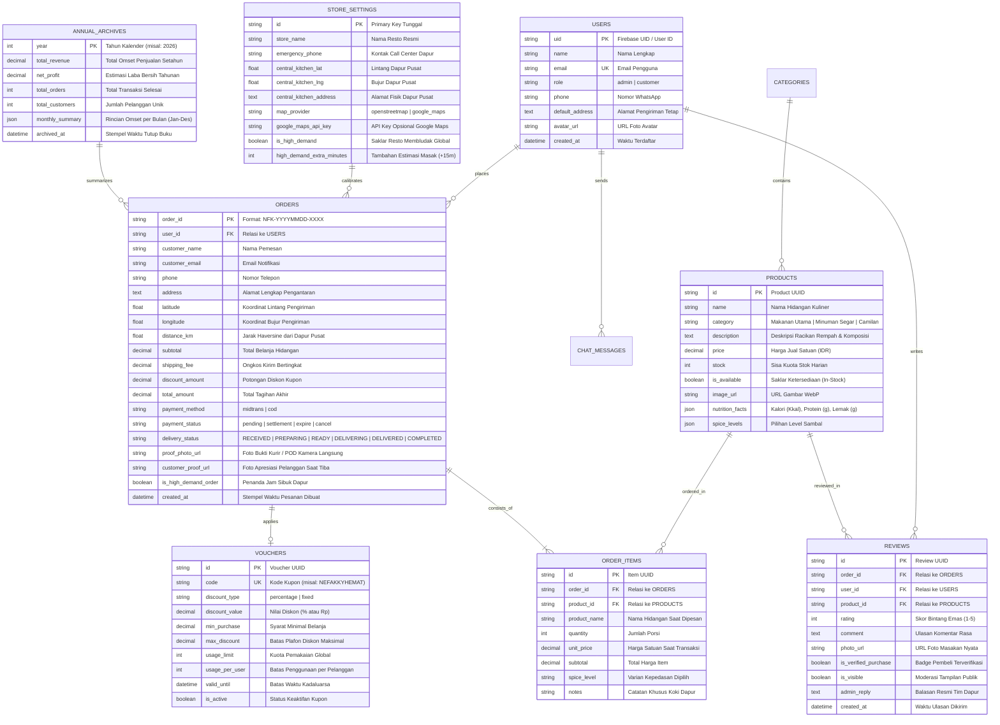

# Skema Basis Data & Desain Relasi — Nefakky Marketplace

**Sistem Manajemen Basis Data**: Multi-Tier Storage Architecture (Next.js Server JSON Stores `.orders_store.json` & `.chat_store.json`, Google Firebase Firestore / RTDB, MySQL 8.0+ / SQLite Laravel, serta LocalStorage Resilient Enkapsulasi Klien)  
**Versi Skema**: 4.8.0 (Updated September 2026 — Multi-Tier Server Store, Cross-Incognito Realtime Bridge & Voucher Deduplication)  
**ORM / Data Driver**: Next.js Server Store File I/O, Laravel Eloquent ORM & Firebase Web SDK v10+  

---

## 1. Diagram Relasi Entitas (Entity-Relationship Diagram / ERD)


```mermaid
erDiagram
    USERS ||--o{ ORDERS : "places"
    USERS ||--o{ REVIEWS : "writes"
    USERS ||--o{ CHAT_MESSAGES : "sends"
    
    CATEGORIES ||--o{ PRODUCTS : "contains"
    
    PRODUCTS ||--o{ ORDER_ITEMS : "ordered_in"
    PRODUCTS ||--o{ REVIEWS : "reviewed_in"
    
    ORDERS ||--|{ ORDER_ITEMS : "consists_of"
    ORDERS ||--o| VOUCHERS : "applies"

    STORE_SETTINGS ||--o{ ORDERS : "calibrates"
    ANNUAL_ARCHIVES ||--o{ ORDERS : "summarizes"

    USERS {
        string uid PK "Firebase UID / User ID"
        string name "Nama Lengkap"
        string email UK "Email Pengguna"
        string role "admin | customer"
        string phone "Nomor WhatsApp"
        text default_address "Alamat Pengiriman Tetap"
        string avatar_url "URL Foto Avatar"
        datetime created_at "Waktu Terdaftar"
    }

    PRODUCTS {
        string id PK "Product UUID"
        string name "Nama Hidangan Kuliner"
        string category "Makanan Utama | Minuman Segar | Camilan"
        text description "Deskripsi Racikan Rempah & Komposisi"
        decimal price "Harga Jual Satuan (IDR)"
        int stock "Sisa Kuota Stok Harian"
        boolean is_available "Saklar Ketersediaan (In-Stock)"
        string image_url "URL Gambar WebP"
        json nutrition_facts "Kalori (Kkal), Protein (g), Lemak (g)"
        json spice_levels "Pilihan Level Sambal"
    }

    ORDERS {
        string order_id PK "Format: NFK-YYYYMMDD-XXXX"
        string user_id FK "Relasi ke USERS"
        string customer_name "Nama Pemesan"
        string customer_email "Email Notifikasi"
        string phone "Nomor Telepon"
        text address "Alamat Lengkap Pengantaran"
        float latitude "Koordinat Lintang Pengiriman"
        float longitude "Koordinat Bujur Pengiriman"
        float distance_km "Jarak Haversine dari Dapur Pusat"
        decimal subtotal "Total Belanja Hidangan"
        decimal shipping_fee "Ongkos Kirim Bertingkat"
        decimal discount_amount "Potongan Diskon Kupon"
        decimal total_amount "Total Tagihan Akhir"
        string payment_method "midtrans | cod"
        string payment_status "pending | settlement | expire | cancel"
        string delivery_status "RECEIVED | PREPARING | READY | DELIVERING | DELIVERED | COMPLETED"
        string proof_photo_url "Foto Bukti Kurir / POD Kamera Langsung"
        string customer_proof_url "Foto Apresiasi Pelanggan Saat Tiba"
        boolean is_high_demand_order "Penanda Jam Sibuk Dapur"
        datetime created_at "Stempel Waktu Pesanan Dibuat"
    }

    ORDER_ITEMS {
        string id PK "Item UUID"
        string order_id FK "Relasi ke ORDERS"
        string product_id FK "Relasi ke PRODUCTS"
        string product_name "Nama Hidangan Saat Dipesan"
        int quantity "Jumlah Porsi"
        decimal unit_price "Harga Satuan Saat Transaksi"
        decimal subtotal "Total Harga Item"
        string spice_level "Varian Kepedasan Dipilih"
        string notes "Catatan Khusus Koki Dapur"
    }

    VOUCHERS {
        string id PK "Voucher UUID"
        string code UK "Kode Kupon (misal: NEFAKKYHEMAT)"
        string discount_type "percentage | fixed"
        decimal discount_value "Nilai Diskon (% atau Rp)"
        decimal min_purchase "Syarat Minimal Belanja"
        decimal max_discount "Batas Plafon Diskon Maksimal"
        int usage_limit "Kuota Pemakaian Global"
        int usage_per_user "Batas Penggunaan per Pelanggan"
        datetime valid_until "Batas Waktu Kadaluarsa"
        boolean is_active "Status Keaktifan Kupon"
    }

    REVIEWS {
        string id PK "Review UUID"
        string order_id FK "Relasi ke ORDERS"
        string user_id FK "Relasi ke USERS"
        string product_id FK "Relasi ke PRODUCTS"
        int rating "Skor Bintang Emas (1-5)"
        text comment "Ulasan Komentar Rasa"
        string photo_url "URL Foto Masakan Nyata"
        boolean is_verified_purchase "Badge Pembeli Terverifikasi"
        boolean is_visible "Moderasi Tampilan Publik"
        text admin_reply "Balasan Resmi Tim Dapur"
        datetime created_at "Waktu Ulasan Dikirim"
    }

    STORE_SETTINGS {
        string id PK "Primary Key Tunggal"
        string store_name "Nama Resto Resmi"
        string emergency_phone "Kontak Call Center Dapur"
        float central_kitchen_lat "Lintang Dapur Pusat"
        float central_kitchen_lng "Bujur Dapur Pusat"
        text central_kitchen_address "Alamat Fisik Dapur Pusat"
        string map_provider "openstreetmap | google_maps"
        string google_maps_api_key "API Key Opsional Google Maps"
        boolean is_high_demand "Saklar Resto Membludak Global"
        int high_demand_extra_minutes "Tambahan Estimasi Masak (+15m)"
    }

    ANNUAL_ARCHIVES {
        int year PK "Tahun Kalender (misal: 2026)"
        decimal total_revenue "Total Omset Penjualan Setahun"
        decimal net_profit "Estimasi Laba Bersih Tahunan"
        int total_orders "Total Transaksi Selesai"
        int total_customers "Jumlah Pelanggan Unik"
        json monthly_summary "Rincian Omset per Bulan (Jan-Des)"
        datetime archived_at "Stempel Waktu Tutup Buku"
    }
```

---

## 2. Koleksi Firebase Firestore (NoSQL Cloud Architecture)

Dalam implementasi frontend web Next.js (`DataContext.tsx`), struktur dokumen Firestore diorganisasikan ke dalam koleksi terisolasi:

1. **`products`**:
   - Berisi katalog hidangan kuliner, stok bahan, nilai nutrisi, dan saklar ketersediaan.
2. **`orders`**:
   - Berisi rekam jejak pesanan, status alur 5-tahap, foto bukti serah terima kurir, dan riwayat pembayaran Midtrans.
3. **`vouchers`**:
   - Berisi kupon promosi aktif beserta batasan minimum belanja dan tanggal kadaluarsa.
4. **`reviews`**:
   - Berisi testimoni komunitas, rating bintang, dan lampiran foto sajian.
5. **`chatMessages`**:
   - Berisi percakapan live chat antara akun pengguna dan meja operator CS.
6. **`storeSettings`**:
   - Berisi koordinat GPS Central Kitchen, provider peta aktif, dan status darurat *High Demand*.

---

## 3. Strategi Indexing & Optimasi Query

Untuk menjamin kueri cepat tanpa hambatan:
* **Composite Index**:
  - `orders`: `user_id` ASC + `created_at` DESC (untuk mengambil riwayat pesanan pengguna secara instan).
  - `orders`: `delivery_status` ASC + `created_at` ASC (untuk antrean dapur FIFO).
  - `reviews`: `product_id` ASC + `is_visible` ASC + `created_at` DESC (untuk render tab review menu).
* **Tabular Numbers Format**:
  - Seluruh kolom moneter disimpan dalam format integer atau float tanpa desimal pembulatan untuk menjaga akurasi perhitungan laporan keuangan.

---

## 4. Skema Penyimpanan Berkas Server JSON (`.orders_store.json` & `.chat_store.json`)

Untuk mendukung ketahanan terhadap partisi peramban (Incognito) dan lingkungan tanpa database server eksternal, platform mengimplementasikan *High-Performance File Stores* berbasis JSON di sisi server Next.js.

### 4.1 Skema Data Pesanan Server (`.orders_store.json`)
Setiap elemen dalam berkas `.orders_store.json` merepresentasikan satu entitas `AdminOrder`:
```typescript
interface OrderItem {
  id: string;               // ID hidangan (misal: "m1", "m6_Mangga")
  name: string;             // Nama sajian
  price: number;            // Harga satuan saat dibeli
  quantity: number;         // Jumlah porsi
  image?: string;           // Path URL gambar sajian
}

interface AdminOrder {
  id: string;               // ID unik pesanan ("NFK-890783" atau "ORD-88219")
  customerName: string;     // Nama pembeli
  customerEmail: string;    // Alamat email pelanggan
  userId?: string;          // UID Firebase pelanggan (jika login)
  avatar: string;           // URL Avatar pengguna
  address: string;          // Alamat pengantaran lengkap
  phone: string;            // Nomor kontak WhatsApp / telepon
  items: OrderItem[];       // Array rincian hidangan
  itemCount: number;        // Total jumlah item dipesan
  paymentMethod: string;    // "Virtual Account BCA (Midtrans)", "Tunai (COD)", dll.
  paymentBadge: 'PAID' | 'AWAITING' | 'REFUNDED' | 'FAILED' | 'CANCELLED';
  deliveryType: string;     // "KURIR NEFAKKY", "EXPRESS", "STANDARD"
  distance?: string;        // Jarak kalkulasi Haversine ("3.1 Km")
  status: 'RECEIVED' | 'PREPARING' | 'COOKING' | 'READY' | 'DELIVERING' | 'COMPLETED' | 'CANCELLED';
  subtotal: number;         // Nilai belanja sebelum ongkir & promo
  shippingCost: number;     // Biaya pengantaran bertingkat
  discount: number;         // Nilai potongan promo
  total: number;            // Total bayar akhir
  date: string;             // Representasi teks waktu lokal Indonesia (WIB)
  createdAt?: number;       // Stempel waktu Unix epoch milidetik (misal: 1790512878381)
  updatedAt?: number;       // Stempel waktu Unix epoch mutasi terakhir
  voucherCode?: string;     // Kode kupon promo terpakai
  appliedPromo?: string;    // Alias kode voucher
  customerConfirmed?: boolean; // Konfirmasi serah terima oleh pelanggan
  confirmedAt?: string;     // Waktu pelanggan melakukan konfirmasi
  proofPhoto?: string;      // URL/Base64 foto bukti serah terima kurir (POD)
  proofPhotoUrl?: string;   // Alias URL foto bukti serah terima
  paymentProofPhoto?: string; // URL/Base64 foto bukti bayar tunai COD
  paymentProofPhotoUrl?: string; // Alias URL foto bukti bayar
  cancellationReason?: string; // Alasan pembatalan (jika status CANCELLED)
  isDeleted?: boolean;      // Penanda soft-delete
}
```

### 4.2 Skema Data Percakapan Server (`.chat_store.json`)
Setiap elemen merepresentasikan satu pesan instan `ChatMessage`:
```typescript
interface ChatMessage {
  id: string;               // UUID pesan unik
  sender: 'user' | 'admin'; // Aktor pengirim pesan
  text: string;             // Isi pesan obrolan teks
  timestamp: string;        // Waktu kirim (format: "HH:mm WIB" atau ISO string)
  userName?: string;        // Nama tampilan pengguna
  userEmail: string;        // Email pengidentifikasi utas obrolan
  avatar?: string;          // Foto avatar pengirim
  readByAdmin: boolean;     // Status telah dibaca oleh staf CS admin
  readByUser: boolean;      // Status telah dibaca oleh pelanggan
}
```

### 4.3 Strategi Penggabungan LWW (Last-Write-Wins) & Tombstones
- **Resolusi Konflik LWW**: Saat sinkronisasi bulk `action: "sync"` dijalankan, data dengan stempel waktu `updatedAt` atau `createdAt` yang lebih baru akan memenangkan pembaruan field.
- **Tombstones (`nefakky_deleted_orders`)**: ID pesanan yang telah dihapus oleh admin disimpan dalam daftar *tombstones* di `localStorage` klien untuk mencegah pesanan terhapus muncul kembali (*resurrecting*) saat menerima respons sinkronisasi dari server atau RTDB.
