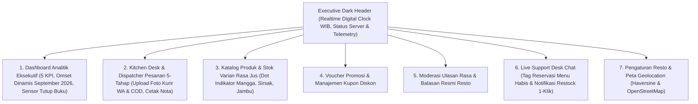

# Spesifikasi Desain Antarmuka: Enterprise Admin Command Center — Nefakky Marketplace

**Versi Dokumen**: 4.0.0 (Anti-AI-Slop Executive POS, Realtime Calendar Synchronization, & Kitchen Desk Telemetry)  
**Target Modul**: Administrator, Kitchen Desk, Cashier POS, Multi-User Support Chat, & Operational Command Center (`/admin`)  
**Framework Frontend**: Next.js 14.2 (App Router), React 18, Tailwind CSS v3.4, Lucide React, FastExcel, DomPDF, Leaflet, Realtime Calendar Clock  
**Status**: Production Standard (100% Passed Test Suite, Type-Safe, WCAG 2.1 AA Accessible)  
**Penulis**: Tim Pengembang Nefakky & Google Stitch AI Design System  

---

## 1. Arsitektur Tata Letak Command Center

---

## 2. Rincian Desain Antarmuka per Tab Command Center

### 2.1 Executive Dark Header (`AdminHeader.tsx`)
* **Skema Visual**: Background gelap *Deep Navy/Slate* pekat (`#0F172A`), border halus (`#334155`), dan teks putih berkontras tinggi.
* **Realtime Digital Clock WIB (`Asia/Jakarta`)**:
  * Menampilkan Hari, Tanggal, Bulan, Tahun, serta Jam, Menit, dan Detik yang berdetak realtime dengan sinkronisasi ke kalender aktif (September 2026).
* **Indikator Telemetri Sistem**:
  * Status Database: *Database Live Connected* (Dot Hijau Emerald).
  * Status Sinkronisasi: *Realtime Sync Active* (Dot Biru Sky).
  * Notifikasi Pesanan Masuk: Counter badge dengan highlight oranye kontras.
* **Tab Switcher Cepat**: Navigasi horizontal 7 modul operasional utama.

---

### 2.2 Tab 1: Dashboard & Analitik Eksekutif (`AdminDashboardTab.tsx`)
* **5 Kartu Metrik KPI Utama**:
  1. *Total Omset Penjualan (Gross Revenue)*: Akumulasi pendapatan online dan bazar offline secara dinamis.
  2. *Estimasi Laba Bersih (Net Profit)*: Dihitung 40% dari total omset kotor setelah dikurangi HPP bahan baku.
  3. *Total Volume Pesanan*: Jumlah seluruh pesanan aktif dan terselesaikan.
  4. *Average Order Value (AOV)*: Nilai rata-rata per transaksi belanja.
  5. *Skor Kepuasan Pelanggan (CSAT)*: Rating rata-rata komunitas ulasan (skala 5.0 bintang).
* **Grafik Penjualan Dinamis Realtime (September 2026)**:
  * Pilihan Timeframe: **7 Hari Terakhir**, **Bulan Ini (Sep 2026)**, **Semester 2 (Jul - Des 2026)**, dan **Kuartal (Q1 - Q4 2026)**.
  * Grafik batang interaktif yang dapat diklik untuk membuka modal rincian keuangan per bulan.
  * Perhitungan akurat semester 2 (`Jul + Agu + Sep = Rp 29.2 Jt`) yang terhubung langsung dengan kalender riil.
* **Modal POS Logger Omset Bazar Offline**:
  * Pencatatan transaksi bazar kuliner offline (Festival Kuliner, Bazar UMKM) dengan input nama event, tanggal, dan omset.
  * Tombol pemilihan status: *Ada Event Bazar / Promo* (ikon `<PartyPopper />`) atau *Penjualan Reguler Standar* (ikon `<Store />`) tanpa emoji kartun.
* **Sensor Otomatisasi Tutup Buku & Arsip Tahunan**:
  * Sensor kalender otomatis yang mendeteksi pergantian tahun (misal: saat memasuki 1 Januari 2027).
  * Data tahun aktif (2026) langsung diarsipkan secara permanen dan dapat diekspor otomatis ke **Excel (.xlsx)** dan **PDF**.
  * Dilengkapi indikator pulse dot hijau: `Standby (Tahun Aktif 2026 - Berjalan Normal)`.

---

### 2.3 Tab 2: Kitchen Desk & Dispatcher Pesanan (`AdminOrdersTab.tsx`)
* **High-Demand Warning Banner**:
  * Muncul otomatis saat antrean pesanan aktif mencapai $\ge 5$ order, memberi peringatan visual bergaris terakota bagi staf dapur.
* **Alur Status Sekuensial Anti-AI-Slop**:
  * Seluruh tombol aksi status menggunakan ikon vektor SVG presisi dari Lucide Icons (tanpa emoji kartun 3D):
    - `Siapkan Pesanan`: Menggunakan `<ChefHat className="w-3.5 h-3.5" />` (Background Cokelat Dapur `#934B19`).
    - `Pesanan Siap`: Menggunakan `<PackageCheck className="w-3.5 h-3.5" />` (Background Ungu `#7C3AED`).
    - `Berangkat Antar`: Menggunakan `<Truck className="w-3.5 h-3.5" />` (Background Biru `#1D4ED8`).
    - `Tiba di Lokasi`: Menggunakan `<MapPin className="w-3.5 h-3.5" />` (Background Cyan `#0E7490`).
    - `Selesai & Lunas`: Menggunakan `<CheckCircle2 className="w-3.5 h-3.5" />` (Background Hijau Emerald `#047857`).
  * Dropdown selector status menggunakan teks formal: `RECEIVED`, `PREPARING`, `READY`, `DELIVERING`, `DELIVERED`, `COMPLETED`, `CANCELLED`.
* **Slot Bukti Foto Kurir & Akuntabilitas Kasir**:
  * *Foto Bukti Makanan (WhatsApp Kurir)*: Unggah foto hidangan saat diserahterimakan kepada pembeli.
  * *Foto Bukti Uang COD*: Khusus pesanan tunai/COD, kurir mengunggah foto uang pas yang diterima untuk audit kas harian.
  * Lightbox modal untuk melihat foto ukuran penuh secara detail.
* **Pencetakan Nota Kasir Thermal**:
  * Tombol **Nota** untuk pratinjau struk kasir format thermal (58mm/80mm) yang siap dicetak langsung ke printer kasir mini.

---

### 2.4 Tab 3: Katalog Produk & Inventaris Varian (`AdminProductsTab.tsx`)
* **Manajemen CRUD Produk Terpadu**:
  * Tambah hidangan baru, edit rincian harga, kelola foto, dan atur status visibilitas (*Aktif / Draft*).
  * Input informasi nutrisi (Kalori, Protein, Lemak) dan resep rempah.
* **Manajemen Varian Stok Minuman Jus Segar**:
  * Pemisahan stok per varian rasa khusus produk jus:
    - **Jus Mangga**: Dilengkapi *Amber Dot* (`bg-amber-500`).
    - **Jus Sirsak**: Dilengkapi *Emerald Dot* (`bg-emerald-500`).
    - **Jus Jambu**: Dilengkapi *Rose Dot* (`bg-rose-500`).
  * Desain minimalis tanpa emoji buah kartun generic yang terlihat murahan.

---

### 2.5 Tab 4: Voucher Promosi & Kupon Diskon (`AdminPromotionsTab.tsx`)
* **Generator Kode Kupon**:
  * Pembuatan kode kupon unik (misal: `NEFAKKYSEGAR`, `DISKON30`).
  * Jenis potongan: Persentase (%) atau Nominal Tetap (Rp).
  * Batas minimum transaksi belanja (*Min Spend*) dan kuota pemakaian maksimal.
  * Masa berlaku tanggal mulai dan kedaluwarsa otomatis.

---

### 2.6 Tab 5: Moderasi Ulasan Rasa Komunitas (`AdminReviewsTab.tsx`)
* **Monitoring & Moderasi Ulasan Pelanggan**:
  * Memantau rating bintang dan foto hidangan yang diunggah konsumen.
  * Filter ulasan: Rating tinggi (4–5 bintang) vs Butuh Perhatian ($\le 3$ bintang).
  * Fitur kirim tanggapan resmi dari nama **CS Admin Resto** yang langsung muncul di feed komunitas pelanggan.

---

### 2.7 Tab 6: Live Support Desk Chat (`AdminLiveChatTab.tsx`)
* **Multi-User Chat Hub**:
  * Daftar percakapan aktif berdasarkan email pelanggan dengan indikator pesan belum terbaca (*Unread Badge*).
* **Tag Identifikasi Permintaan Reservasi**:
  * Pesan dari pelanggan yang melakukan reservasi menu habis ditandai dengan badge resmi `<Tag /> PERMINTAAN RESERVASI PRODUK HABIS`.
* **Tombol Restock Alert 1-Klik**:
  * Tombol aksi cepat **Kabari Restock** yang langsung mengisi formulir chat dengan teks sopan pemberitahuan ketersediaan menu kembali di dapur.
* **Template Balasan Cepat (Quick Replies)**:
  * Template bersih tanpa emoji slop untuk update progres dapur, konfirmasi kurir, dan alamat antar.

---

### 2.8 Tab 7: Pengaturan Resto & Peta Geolocation (`AdminSettingsTab.tsx`)
* **Konfigurasi Mesin Peta & Kalkulator Jarak**:
  * Pilihan mode: **OpenStreetMap (Default Gratis, Tanpa API Key)** atau **Google Maps**.
  * Koordinat Dapur Utama: *Puri Bojong Lestari Blok AF 41, Bojong Gede, Bogor* (`-6.4862, 106.7925`).
  * Radius pengantaran maksimal (25 km) dan formula tarif ongkos kirim Haversine bertingkat.
* **Profil Legalitas Resto**:
  * Identitas resmi UMKM, jam buka dapur, nomor kontak darurat pengiriman, dan kebijakan retur makanan.

---

## 3. Palet Warna & Token Visual Admin POS

| Elemen Antarmuka | Nilai Hex / Tailwind | Kegunaan & Karakteristik |
| :--- | :--- | :--- |
| **Dark Header** | `#0F172A` (Deep Slate/Navy) | Header telemetri eksekutif, jam digital, status server |
| **Canvas Background** | `#F8FAFC` (Slate-50) | Latar belakang modul kerja siang hari yang bersih dan jernih |
| **Card Surface** | `#FFFFFF` (Pure White) | Kartu pesanan, formulir input produk, modal dialog |
| **Primary Accent** | `#934B19` (Warm Terracotta) | Tombol aksi dapur utama, highlight status penting |
| **Status READY** | `#7C3AED` (Purple-700) | Tombol status pesanan siap di Kitchen Desk |
| **Status DELIVERING**| `#1D4ED8` (Blue-700) | Tombol status kurir berangkat antar |
| **Status COMPLETED** | `#047857` (Emerald-700) | Tombol status pesanan selesai & lunas |
| **Ikonografi** | Lucide React (Stroke 1.75–2.0) | 100% vektor SVG presisi tanpa emoji kartun 3D |
