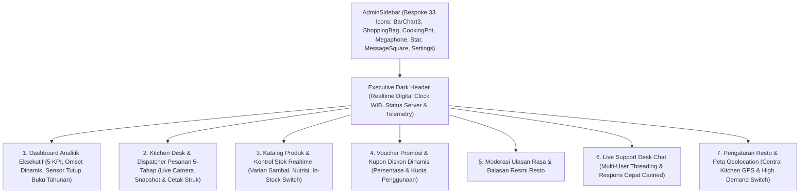

# Spesifikasi Desain Antarmuka: Enterprise Admin Command Center — Nefakky Marketplace

**Versi Dokumen**: 4.5.0 (Anti-AI-Slop Executive POS, Realtime Calendar Synchronization, & Kitchen Desk Telemetry)  
**Target Modul**: Administrator, Kitchen Desk, Cashier POS, Multi-User Support Chat, & Operational Command Center (`/admin`)  
**Framework Frontend**: Next.js 14.2 (App Router), React 18, Tailwind CSS, 33 Custom Vector Icons, HTML2Canvas & jsPDF, Leaflet / Google Maps, Realtime Calendar Clock  
**Status**: Production Standard (100% Passed Test Suite, Type-Safe, WCAG 2.1 AA Accessible)  

---

## 1. Arsitektur Tata Letak Command Center

---

## 2. Rincian Desain Antarmuka per Modul Command Center

### 2.1 Sidebar Navigasi Terpadu (`AdminSidebar.tsx`)
* **Visual Identity**: Panel gelap `#0B0F19` dengan pembatas `border-slate-800`, wordmark tebal *NEFAKKY COMMAND STUDIO*, dan indikator denyut oranye (`bg-[#FF5400] animate-pulse`).
* **Navigasi 7 Modul Berbasis Ikon Kustom Autentik**:
  1. *Business Overview* (`BarChart3`): Tinjauan analitik finansial dan tren omset.
  2. *Katalog Produk* (`ShoppingBag`): Manajemen hidangan dan kontrol stok bahan.
  3. *Dapur & Pesanan* (`CookingPot`): Antrean kitchen desk dan pelacakan kurir (disertai badge pesanan baru aktif).
  4. *Kupon & Promosi* (`Megaphone`): Pengaturan kode promo dan diskon belanja.
  5. *Moderasi Ulasan* (`Star`): Ulasan rasa dan testimoni pelanggan.
  6. *CS Live Desk* (`MessageSquare`): Obrolan layanan pelanggan (badge pesan belum dibaca berdenyut).
  7. *Pengaturan & GPS* (`Settings`): Koordinat Central Kitchen dan provider peta.

---

### 2.2 Tab 1: Dashboard & Analitik Eksekutif (`AdminDashboardTab.tsx`)
* **5 Kartu Metrik KPI Utama**:
  1. *Total Omset Penjualan (Gross Revenue)*: Akumulasi transaksi online dan bazar offline.
  2. *Estimasi Laba Bersih (Net Profit)*: Dihitung 40% dari total omset kotor setelah HPP bahan baku.
  3. *Total Volume Pesanan*: Jumlah seluruh pesanan aktif dan terselesaikan.
  4. *Average Order Value (AOV)*: Nilai rata-rata per transaksi keranjang belanja.
  5. *Skor Kepuasan Pelanggan (CSAT)*: Rating rata-rata ulasan hidangan (skala 5.0 bintang emas).
* **Visualisasi Penjualan Dinamis**:
  * Pilihan Timeframe: *7 Hari Terakhir*, *Bulan Ini*, *Semester 2*, dan *Kuartal*.
  * Grafik batang interaktif yang dapat diklik untuk membuka popover rincian transaksi per bulan.
* **Logger Transaksi Bazar Offline / Event Promo**:
  * Form pencatatan penjualan offline dengan nominal rupiah, nama event, dan tanggal pelaksanaan.
* **Sensor Tutup Buku & Arsip Otomatis Tahunan**:
  * Mendeteksi pergantian tahun secara otomatis dan mengarsipkan ledger tahunan.
  * Fitur ekspor laporan lengkap ke format **Excel (.xlsx)** via `Download` dan **PDF resmi** via `Pdf`.

---

### 2.3 Tab 2: Kitchen Desk & Dispatcher Pesanan (`AdminOrdersTab.tsx`)
* **Alur Pemrosesan Pesanan 5-Tahap Sekuensial**:
  * `RECEIVED` $\rightarrow$ `PREPARING` $\rightarrow$ `READY` $\rightarrow$ `DELIVERING` $\rightarrow$ `DELIVERED` / `COMPLETED`.
* **Dropdown Kontrol Status Instan**:
  * Mengubah status pesanan secara langsung tanpa reload.
* **Integrasi Kamera Langsung (Live Camera Snapshot POD)**:
  * Modal penangkapan kamera langsung (`LiveCameraModal.tsx`) untuk kurir/staf dapur mengambil foto serah terima barang atau bukti pembayaran COD secara real-time melalui kamera perangkat.
  * Pilihan unggah berkas alternatif dari memori lokal.
* **Cetak Struk Kasir Thermal (Thermal Receipt Printing)**:
  * Format cetak struk kasir 58mm / 80mm standar POS kasir restoran dengan nomor transaksi, rincian hidangan, subtotal, diskon voucher, ongkir, dan barcode unik.

---

### 2.4 Tab 3: Katalog Produk & Kontrol Stok (`AdminProductsTab.tsx`)
* **Manajemen Hidangan**:
  * Tambah, perbarui, dan arsipkan hidangan kuliner dengan foto, nama, deskripsi rempah, dan harga.
* **Saklar Stok Instan (In-Stock / Sold-Out Toggle)**:
  * Tombol saklar 1-klik untuk menonaktifkan menu saat bahan baku dapur habis, secara otomatis memblokir pemesanan baru pada katalog publik.
* **Informasi Nilai Gizi & Varian Sambal**:
  * Input kalori, protein, lemak sehat, serta opsi sambal terpisah.

---

### 2.5 Tab 4: Kupon Promosi & Voucher Diskon (`AdminPromotionsTab.tsx`)
* **Voucher Builder**:
  * Pembuatan kode promo (misal: `NEFAKKYHEMAT`, `DISKONGAJIAN`).
  * Pilihan tipe potongan: Persentase (%) atau Nominal Tetap (Rp).
  * Batas minimum transaksi belanja dan kuota klaim per pengguna.

---

### 2.6 Tab 5: Moderasi Ulasan & Komentar (`AdminReviewsTab.tsx`)
* **Filter Bintang & Foto**:
  * Memfilter ulasan berdasarkan bintang (1 hingga 5) atau ulasan yang melampirkan foto masakan asli.
* **Visibilitas Publik & Balasan Resto**:
  * Saklar tampilkan/sembunyikan ulasan di halaman publik.
  * Kolom balasan resmi dari tim dapur atau pemilik restoran.

---

### 2.7 Tab 6: CS Live Desk Chat (`AdminLiveChatTab.tsx`)
* **Inbox Percakapan Terpadu**:
  * Daftar kontak pelanggan dengan indikator pesan belum dibaca (*unread indicator*).
* **Respons Cepat Dapur (Canned Responses)**:
  * Tombol balasan template 1-klik untuk pertanyaan seputar estimasi waktu pengantaran, rincian bahan non-alergen, dan nomor rekening konfirmasi.
* **Dukungan Berkas & Foto**:
  * Mengirimkan foto hidangan langsung ke chat pelanggan.

---

### 2.8 Tab 7: Pengaturan Restoran & Central Kitchen GPS (`AdminSettingsTab.tsx`)
* **Koordinat Central Kitchen**:
  * Konfigurasi koordinat Lintang (*Latitude*) dan Bujur (*Longitude*) dapur utama sebagai patokan kalkulasi ongkir Haversine.
* **Pilihan Provider Peta**:
  * Mendukung **OpenStreetMap / Nominatim** (tanpa kunci API) dan **Google Maps Platform** (dengan input API Key dinamis).
* **Saklar Darurat High Demand (Resto Membludak)**:
  * Mengaktifkan estimasi waktu memasak ekstra (+15 menit) yang otomatis terpancar ke banner notifikasi dan pelacak pesanan seluruh pelanggan.
