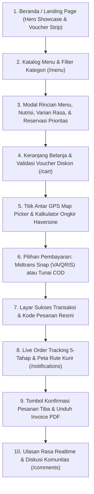

# Spesifikasi Desain Antarmuka: Customer Facing Application — Nefakky Marketplace

**Versi Dokumen**: 4.0.0 (Anti-AI-Slop Editorial Design, Realtime Community Reviews, & Priority Reservation System)  
**Target Modul**: Antarmuka Belanja Pelanggan (Beranda, Katalog Menu, Detail & Varian Menu, Cart Checkout Stepper, Live GPS Tracking, Ulasan Rasa Komunitas, Profil Akun & CS Chat)  
**Framework Frontend**: Next.js 14.2 (App Router), React 18, Tailwind CSS v3.4, Lucide React, Leaflet / OpenStreetMap, Midtrans Snap SDK  
**Status**: Production Standard (100% Passed Test Suite, Type-Safe, WCAG 2.1 AA Accessible)  
**Penulis**: Tim Pengembang Nefakky & Google Stitch AI Design System  

---

## 1. Alur Perjalanan Pengguna (User Journey Map)

---

## 2. Rincian Desain Antarmuka per Halaman

### 2.1 Beranda Utama (`/`)
* **Header Navigasi Terintegrasi (`Navbar.tsx`)**:
  * Wordmark bersih *NEFAKKY* dengan tipografi tebal bergaya artisanal.
  * Tautan desktop: *Beranda*, *Menu*, *Ulasan Rasa*, *Status Pesanan*.
  * Indikator keranjang belanja dinamis dengan penghitung item realtime.
  * Avatar profil pengguna dengan pintasan cepat ke *Profil Akun*, *Live Chat*, dan *Panel Admin* (bagi role administrator).
  * Bottom navigation bar 5-kolom dengan ikon Lucide untuk perangkat mobile.
* **Hero Showcase Banner**:
  * Foto hidangan beresolusi tinggi dengan pencahayaan hangat menggugah selera (Bebek Betutu, Nasi Bakar Rempah, Ayam Taliwang).
  * Tagline editorial berwibawa: *Cita Rasa Warisan Nusantara yang Diolah Jujur Tanpa Pengawet*.
  * Tombol CTA ganda: *Eksplorasi Menu* (Nordic Citrus Orange `#FF5400`) dan *Lihat Ulasan Pelanggan* (outline elegan).
* **Floating Category Bar**:
  * Tombol pill rounded-full: *Semua*, *Makanan Berat*, *Minuman Segar*, *Menu Hemat*.
* **Voucher Promo Strip**:
  * Pita informasi kupon aktif dengan tombol salin kode kupon 1-klik.
* **Section Filosofi Dapur**:
  * 3 Nilai Inti: *100% Rempah Segar Pilihan*, *Bebas Bahan Pengawet Sintetis*, dan *Pengiriman Cepat Tepat Waktu*.

---

### 2.2 Katalog Menu & Modal Rincian Hidangan (`/menu`, `MenuDetailModal.tsx`)
* **Kontrol Katalog**:
  * Bilah pencarian teks realtime dengan debounce mulus.
  * Dropdown urutan: *Terpopuler*, *Rating Tertinggi*, *Harga Termurah*, *Harga Termahal*.
* **Kartu Produk Anti-AI-Slop**:
  * Bingkai kartu minimalis berjarak lega (`p-4`), sudut melengkung `rounded-2xl`, tanpa badge kartun berlebihan.
  * Tag kategori elegan dan badge level kepedasan.
* **Modal Rincian Menu & Nutrisi Lengkap**:
  * Galeri foto hidangan resolusi tinggi.
  * Informasi kalori (Kkal), protein (g), dan lemak sehat (g).
  * Pilihan level sambal/kepedasan dan kolom catatan resep kustom.
  * Pilihan varian rasa khusus menu minuman jus (Mangga, Sirsak, Jambu) dengan visual dot indikator warna.
* **Sistem Reservasi Prioritas Menu Habis**:
  * Jika stok produk 0 (Habis), tombol belanja otomatis berganti menjadi **"Kirim Reservasi Prioritas"**.
  * Menekan tombol ini akan mengirimkan notifikasi terstruktur `[RESERVASI PRODUK HABIS]` langsung ke Live Chat CS admin sehingga pelanggan diprioritaskan saat stok kembali dimasak.

---

### 2.3 Alur Checkout 4-Tahap (`/cart`)

#### Tahap 1: Keranjang Belanja (Cart Review)
* Daftar item pesanan lengkap dengan foto thumbnail, nama menu, varian rasa, harga satuan, dan kontrol kuantitas (+/-).
* Fitur klaim voucher kupon promo dengan validasi otomatis minimum belanja (*Min Spend*).
* Ringkasan biaya otomatis: Subtotal, Potongan Diskon, Biaya Kemasan Higienis, dan Estimasi Ongkir.

#### Tahap 2: Pengiriman & Titik Antar GPS
* Pilihan multi-alamat tersimpan dari akun profil pengguna atau input alamat baru.
* **Peta GPS Picker (`AutoMapPickerModal.tsx`)**:
  * Menggunakan Leaflet / OpenStreetMap untuk memilih titik koordinat presisi pemesan.
  * Reverse geocoding otomatis yang mengisi alamat jalan, kelurahan, dan kecamatan.
* **Kalkulator Ongkos Kirim Haversine**:
  $$\text{Ongkir} = \begin{cases} 
  \text{Rp } 10.000 & \text{jika jarak} \le 10\text{ km} \\ 
  \text{Rp } 10.000 + \left\lceil \dfrac{\text{jarak} - 10}{3} \right\rceil \times \text{Rp } 2.500 & \text{jika jarak} > 10\text{ km} 
  \end{cases}$$
* Kolom catatan khusus kurir (patokan pagar/gang) dan catatan khusus dapur.

#### Tahap 3: Pembayaran Multi-Channel
* **Midtrans Snap Gateway**:
  * Virtual Account Bank (BCA, BNI, BRI, Mandiri, Permata).
  * E-Wallet & QRIS Instan (GoPay, ShopeePay, Dana, OVO, LinkAja).
  * Kartu Kredit / Debit Online dengan enkripsi 3D Secure.
* **Cash on Delivery (COD)**:
  * Pembayaran tunai saat hidangan tiba di tangan pembeli.
  * Banner pengingat nominal uang pas dengan ikon vektor `<Banknote />`.

#### Tahap 4: Konfirmasi Sukses Transaksi
* Kode Order ID unik (misal: `ORD-88219`) dengan ringkasan status pembayaran *PAID* atau *MENUNGGU COD*.
* Tautan instan ke halaman pelacakan status pesanan.

---

### 2.4 Pelacakan Pesanan & Status Pengiriman (`/notifications`, `/order-status`)
* **Stepper Alur 5-Tahap Status**:
  1. `RECEIVED` - Pesanan Diterima Dapur
  2. `PREPARING` - Sedang Disiapkan & Dimasak
  3. `READY` - Pesanan Telah Dikemas Rapi
  4. `DELIVERING` - Kurir Sedang Menuju Lokasi Anda
  5. `COMPLETED` - Pesanan Selesai & Diterima
* **Live Courier Route Map**:
  * Visualisasi jalur perjalanan kurir dari Dapur Utama (*Bojong Gede, Bogor*) ke lokasi pemesan pada peta interaktif Leaflet.
* **Konfirmasi Penerimaan oleh Pelanggan**:
  * Tombol *Konfirmasi Pesanan Telah Sampai* yang secara instan mengirimkan sinyal ke dashboard admin dengan status *Dikonfirmasi Pembeli*.
* **Nota & Invoice Resmi**:
  * Pratinjau nota digital dan tombol unduh PDF resmi.

---

### 2.5 Ulasan Rasa & Komunitas Pelanggan (`/comments`)
* **Realtime Discussion Feed**:
  * Menampilkan ulasan autentik dari para pelanggan yang telah memesan hidangan.
  * Rating bintang presisi (skala 1.0 s/d 5.0).
  * Lampiran foto masakan yang difoto langsung oleh pembeli.
* **Thread Balasan Resmi Resto**:
  * Menampilkan respon hangat dari tim CS Admin Resto dengan badge verifikasi resmi *Official Resto Response*.
* **Formulir Kirim Ulasan**:
  * Modal input ulasan dengan pilihan menu hidangan, bintang interaktif, dan upload foto masakan.

---

### 2.6 Profil Akun & Pusat Bantuan (`/profile`)
* **Pengaturan Akun**:
  * Nama pengguna, email terverifikasi, nomor WhatsApp, dan upload avatar (Galeri, Kamera Webcam Langsung, atau Google Sync).
* **Buku Alamat Pengiriman**: Pengelolaan multi-alamat (Tambah, Edit, Hapus, Jadikan Alamat Utama).
* **Live Chat Terintegrasi**:
  * Layanan chat langsung ke tim Customer Service dapur.
  * Notifikasi instan saat pesanan yang direservasi telah kembali tersedia (*Restock Alert*).
* **Riwayat Pesanan**: Tab filter pesanan (*Semua*, *Aktif*, *Selesai*) dengan tombol *Pesan Lagi* dan *Lacak Pengiriman*.

---

## 3. Desain Komponen & Standar Visual Semantik

| Komponen | Token Desain / Tailwind | Karakteristik UI |
| :--- | :--- | :--- |
| **Navbar Desktop** | `bg-white/95 backdrop-blur border-b border-slate-200` | Rapi, mengapung halus saat di-scroll, bayangan subtil. |
| **Kartu Produk** | `bg-white border border-slate-200/80 rounded-2xl` | Sudut membulat modern, efek zoom gambar mikro saat hover. |
| **Tombol CTA Utama** | `bg-[#FF5400] hover:bg-[#E04800] text-white rounded-xl` | Warna oranye Nordic Citrus berenergi, kontras tinggi. |
| **Badge Diskon** | `bg-amber-100 text-amber-900 border border-amber-300` | Tipografi tegas, mudah terbaca, anti-AI-slop. |
| **Status COD Alert** | `bg-amber-50 border border-amber-200 text-amber-950` | Dilengkapi ikon `<Banknote />` tanpa emoji kartun. |
| **Banner Konfirmasi** | `bg-emerald-50 border border-emerald-300 text-emerald-900` | Ikon `<CheckCircle2 />` penanda sukses. |
