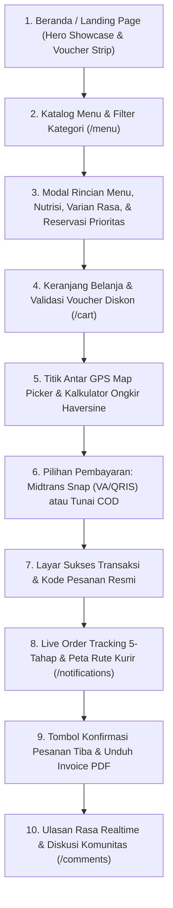

# Spesifikasi Desain Antarmuka: Customer Facing Application — Nefakky Marketplace

**Versi Dokumen**: 4.5.0 (Anti-AI-Slop Bespoke Vector Icons, Realtime Community Reviews, & Priority Reservation System)  
**Target Modul**: Antarmuka Belanja Pelanggan (Beranda, Katalog Menu, Detail & Varian Menu, Cart Checkout Stepper, Live GPS Tracking, Ulasan Rasa Komunitas, Profil Akun & CS Live Chat)  
**Framework Frontend**: Next.js 14.2 (App Router), React 18, Tailwind CSS, 33 Custom Vector Icons, Leaflet / OpenStreetMap / Google Maps, Midtrans Snap SDK  
**Status**: Production Standard (100% Passed Test Suite, Type-Safe, WCAG 2.1 AA Accessible)  

---

## 1. Alur Perjalanan Pengguna (User Journey Map)

---

## 2. Rincian Desain Antarmuka per Halaman

### 2.1 Beranda Utama (`/`)
* **Header Navigasi Terintegrasi (`Navbar.tsx`)**:
  * Wordmark bersih *NEFAKKY* dengan tipografi tebal bergaya artisanal nusantara.
  * Tautan navigasi: *Beranda* (`Home`), *Menu* (`Utensils`), *Ulasan Rasa* (`MessageSquare`), *Status Pesanan* (`Clock`).
  * Ikon keranjang belanja kustom `ShoppingBag` dengan badge jumlah item realtime beranimasi lembut.
  * Avatar profil pengguna dengan dropdown ke *Profil Akun*, *Live Chat*, dan *Command Studio* (untuk akun administrator).
  * Bottom navigation bar 5-kolom ramah jempol untuk perangkat mobile.
* **Hero Showcase Carousel**:
  * Foto hidangan resolusi tinggi dengan pencahayaan hangat menggugah selera (Bebek Betutu, Nasi Bakar Rempah, Ayam Taliwang).
  * Tagline editorial berwibawa: *Cita Rasa Warisan Nusantara yang Diolah Jujur Tanpa Pengawet*.
  * Tombol CTA: *Eksplorasi Menu* (Nordic Citrus Orange `#FF5400`) dan *Lihat Ulasan Pelanggan* (outline elegan).
* **Floating Category Bar**:
  * Tombol pill berbobot: *Semua*, *Makanan Berat*, *Minuman Segar*, *Menu Hemat*.
* **Voucher Promo Strip**:
  * Pita informasi kupon aktif dengan tombol salin kode 1-klik (`Ticket`).

---

### 2.2 Katalog Menu & Modal Rincian Hidangan (`/menu`, `MenuDetailModal.tsx`)
* **Kontrol Pencarian & Filter**:
  * Input pencarian instan dengan ikon `Search` kustom.
  * Dropdown urutan dengan ikon `SlidersHorizontal`: *Terpopuler*, *Rating Tertinggi*, *Harga Termurah*, *Harga Termahal*.
* **Kartu Produk Anti-AI-Slop**:
  * Bingkai kartu minimalis dengan sudut melengkung `rounded-2xl`, tanpa badge kartun berlebihan.
  * Ikon vegetarian `Leaf`, indikator pedas `Flame`, dan rating bintang emas `Star`.
  * Tombol tambah cepat dengan efek haptic visual `active:scale-95`.
* **Modal Rincian Menu (`MenuDetailModal.tsx`)**:
  * Tampilan foto hidangan besar dan badge kebersihan `ShieldCheck`.
  * Rincian nutrisi: Kalori (Kkal), Protein (g), dan Lemak Sehat (g).
  * Opsi varian sambal (Pedas Sedang, Ekstra Pedas, Sambal Matah Terpisah).
  * Kolom catatan khusus untuk koki dapur (*Chef's Note*).

---

### 2.3 Keranjang Belanja & Checkout Pintar (`/cart`)
* **Daftar Pesanan Interaktif**:
  * Kontrol penambahan/pengurangan kuantitas hidangan (`Plus`/`Minus`).
  * Tombol hapus item menggunakan ikon `Trash` kustom.
* **Klaim Voucher Diskon**:
  * Input kode kupon dengan tombol validasi instan (`Ticket`).
  * Perhitungan diskon nominal rupiah atau persentase langsung memotong subtotal secara transparan.
* **Pemilih Alamat GPS & Rute Pengiriman (`AutoMapPickerModal.tsx`)**:
  * Peta interaktif Leaflet OpenStreetMap dengan pin lokasi `MapPin` yang dapat digeser (*draggable*).
  * Integrasi tombol pencarian alamat otomatis via reverse geocoding Nominatim.
  * Perhitungan jarak matematis dari Central Kitchen menggunakan formula Haversine:
    $$\text{Ongkir} = 10.000 + \max\left(0, \lceil \frac{\text{Jarak (km)} - 10}{3} \rceil \times 2.500 \right)$$
* **Pilihan Metode Pembayaran**:
  * **Midtrans Snap Modal**: Pembayaran digital instan via QRIS, GoPay, ShopeePay, Virtual Account BCA/Mandiri/BRI/BNI.
  * **Cash on Delivery (COD)**: Pembayaran tunai saat kurir tiba dengan instruksi nominal uang pas.

---

### 2.4 Pelacakan Pesanan 5-Tahap Realtime (`/notifications`, `RealtimeOrderTracker.tsx`)
* **Stepping Telemetry Dapur**:
  1. `RECEIVED` (`Clock`): Pesanan telah masuk dan diterima tim dapur resto.
  2. `PREPARING` (`ChefHat` / `CookingPot`): Sedang dimasak oleh koki. Menampilkan estimasi ~30 menit (atau ~45 menit jika mode *High Demand* aktif).
  3. `READY` (`CheckCircle2`): Pesanan selesai dikemas higienis dan siap dijemput kurir.
  4. `DELIVERING` (`Truck`): Kurir sedang dalam perjalanan ke alamat pemesan.
  5. `DELIVERED` / `COMPLETED` (`CheckCircle2`): Pesanan tiba di lokasi pelanggan.
* **Konfirmasi Penerimaan oleh Pelanggan**:
  * Tombol *"Konfirmasi Pesanan Diterima"* dengan modal apresiasi dan unggah foto sajian yang tiba.
* **Invoice & Struk Digital**:
  * Tombol cetak struk kasir thermal via `Printer` kustom dan unduh PDF resmi via `Download`.

---

### 2.5 Ulasan Komunitas & Rating Bintang Emas (`/comments`)
* **Formulir Ulasan Rasa Terbuka**:
  * Pemilihan skor bintang 1–5 dengan ikon `Star` emas solid.
  * Unggah foto masakan asli secara langsung via kamera atau galeri dengan ikon `Camera`.
  * Badge verifikasi pembeli resmi (*Verified Diner*).
* **Feed Komentar Sosial**:
  * Desain obrolan editorial dengan avatar profil `User` dan stempel waktu `Clock`.
  * Filter ulasan: *Semua*, *Bintang 5*, *Dengan Foto Masakan*.

---

### 2.6 CS Live Desk & Obrolan Dapur
* **Chatbot & Live Operator**:
  * Widget percakapan instan di pojok kanan bawah dengan ikon `MessageSquare`.
  * Pertanyaan sering diajukan (*FAQ canned responses*): jam buka resto, rekomendasi menu, dan konfirmasi alergen.
  * Dukungan kirim tangkapan layar atau foto bukti via live chat.
