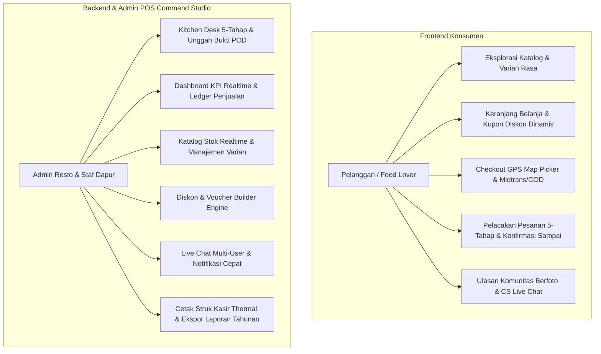

# Product Requirement Document (PRD) — Nefakky Marketplace

**Nama Produk**: Nefakky - Artisanal Food & Culinary Marketplace  
**Versi Dokumen**: 4.5.0 (Updated September 2026 — Anti-AI-Slop & POS Telemetry Architecture)  
**Status**: Production Ready & Fully Validated (`npx tsc --noEmit` 0 Errors)  
**Target Platform**: Web Responsive (Mobile-First, Tablet, Desktop)  
**Tech Stack**: Next.js 14 (App Router, React 18, TypeScript Strict), Tailwind CSS, Custom 33 Bespoke Vector Icon System, Firebase Auth & Firestore, Laravel Reverb WebSocket Broadcaster, Midtrans Snap & Core API, Leaflet / OpenStreetMap / Google Maps Services, Canvas Confetti, HTML2Canvas & jsPDF.

---

## 1. Ringkasan Eksekutif & Latar Belakang

### 1.1 Visi Produk
**Nefakky** adalah platform marketplace kuliner artisanal *Direct-to-Consumer (D2C)* premium yang menyajikan hidangan rumahan tradisional nusantara dan kontemporer berkualitas tinggi (seperti Bebek Betutu Gianyar, Nasi Bakar Rempah, Ayam Taliwang Bakar Madu, hingga Cold-Pressed Fresh Juices). 

Platform ini dirancang khusus untuk menghubungkan konsumen langsung dengan dapur resto tanpa pemotongan komisi ekstrem dari pihak ketiga (20%–35%), dengan jaminan:
- Transparansi ongkos kirim berbasis radius koordinat GPS riil (*Haversine Formula*).
- Pelacakan pesanan 5-tahap secara realtime melalui WebSocket.
- Akuntabilitas serah terima kurir dengan integrasi *Live Camera Snapshot Proof-of-Delivery (POD)*.
- Desain *Anti-AI-Slop* dengan 33 ikon kustom buatan manusia, menolak tampilan generik template AI.

### 1.2 Masalah Industri & Solusi Nefakky

| Masalah Industri Kuliner Online | Solusi Nyata Platform Nefakky |
| :--- | :--- |
| **Potongan Agregator Ekstrem** (Komisi 20–35% memangkas marjin restoran UMKM) | Transaksi direct checkout mandiri via Midtrans Snap (QRIS, VA, E-Wallet) dan COD tanpa perantara komisi. |
| **Ongkir Tidak Transparan & Mark-up Jarak** | Formula tarif bertingkat matematis berbasis *Haversine* ($10\text{rb}/10\text{km} + 2.5\text{rb}/\text{kelipatan }3\text{km}$) terkalibrasi ke koordinat Central Kitchen. |
| **Keterlambatan Konfirmasi Dapur** | Alur kitchen desk 5-tahap sekuensial dengan live alert konfirmasi pelanggan dan integrasi Live Camera snapshot. |
| **Menu Habis Menghilangkan Potensi Pelanggan** | Sistem reservasi prioritas otomatis saat stok habis terintegrasi dengan Live Chat CS untuk pemberitahuan *restock* instan. |
| **Tampilan Template Kaku & "AI Slop"** | Desain editorial *Nordic Citrus & Deep Navy* bersih, tipografi Outfit, bebas emoji kartun murahan, 100% menggunakan 33 ikon kustom autentik. |

---

## 2. Pengguna & Persona



### 2.1 Persona Utama
1. **Pelanggan (Customer / Food Lover)**:
   - Menginginkan pemesanan makanan higienis, cepat, dan transparan dalam perhitungan ongkir.
   - Menginginkan kejelasan estimasi waktu memasak saat jam sibuk (*High Demand*).
   - Membutuhkan update realtime status pengantaran dan chat interaktif dengan admin dapur.
2. **Staf Dapur & Dispatcher (Kitchen Operations)**:
   - Mengatur antrean memasak pesanan masuk secara sekuensial.
   - Mengambil foto bukti kurir secara langsung via kamera perangkat (*Live Camera Capture*).
   - Memverifikasi uang tunai COD untuk rekonsiliasi kas harian.
3. **Owner / Business Admin**:
   - Memantau tren omset kotor, estimasi laba bersih, dan jumlah pesanan secara dinamis.
   - Mengontrol konfigurasi dapur pusat, radius GPS, dan API key map.
   - Melakukan ekspor rekapitulasi penjualan ke Excel dan PDF resmi berformat akuntansi.

---

## 3. Spesifikasi Kebutuhan Fungsional (Functional Requirements)

### 3.1 Modul Konsumen (Customer Experience)
1. **Katalog Menu & Rekomendasi Pintar**:
   - Filter multi-kategori: Semua, Makanan Utama, Camilan Tradisional, Minuman Rempah/Jus Segar.
   - Kolom pencarian instan dengan *live debounce*.
   - Modal detail produk dengan opsi penyesuaian level kepedasan, varian buah, dan catatan koki khusus.
2. **Keranjang Belanja & Voucher Engine**:
   - Perhitungan subtotal otomatis, pajak PB1 resto (jika berlaku), dan potongan promo kupon.
   - Validasi batas tanggal kadaluarsa kupon, kuota penggunaan per user, dan minimal belanja.
3. **Peta Lokasi GPS & Perhitungan Ongkir Haversine**:
   - Pemilih alamat interaktif via OpenStreetMap / Google Maps.
   - Perhitungan jarak garis lurus dan estimasi rute dari koordinat Central Kitchen (`-6.2088, 106.8456` atau kustom).
   - Formula ongkos kirim:
     $$\text{Ongkir} = 10.000 + \max\left(0, \lceil \frac{\text{Jarak (km)} - 10}{3} \rceil \times 2.500 \right)$$
4. **Pembayaran Terintegrasi (Midtrans & COD)**:
   - Midtrans Snap Modal: QRIS, GoPay, ShopeePay, BCA/Mandiri/BNI Virtual Account, Kartu Kredit.
   - Pilihan Cash on Delivery (COD) dengan instruksi penyiapan uang pas.
5. **Pelacak Pesanan 5-Tahap Realtime (Live Order Tracker)**:
   - Tahap 1: Diterima (`RECEIVED`)
   - Tahap 2: Dimasak di Dapur (`PREPARING`) — durasi ~30m normal / ~45m saat High Demand.
   - Tahap 3: Pesanan Siap (`READY`).
   - Tahap 4: Sedang Dikirim Kurir (`DELIVERING`).
   - Tahap 5: Pesanan Tiba & Selesai (`DELIVERED` / `COMPLETED`).
   - Tombol konfirmasi penerimaan pesanan oleh pelanggan dengan modal upload foto apresiasi.
6. **Ulasan Komunitas & Rating Bintang Emas**:
   - Input ulasan masakan 1–5 bintang emas dengan upload bukti foto hidangan.
   - Verifikasi badge pembeli (*Verified Diner*).
7. **CS Live Chat Interaktif**:
   - Komunikasi dua arah langsung antara pelanggan dan tim admin/dapur.
   - Dukungan lampiran foto hidangan dan respons cepat auto-canned.

### 3.2 Modul Admin Command Studio
1. **Business Overview & Visualisasi Keuangan**:
   - Kartu metrik: Total Omset Kotor, Estimasi Margin Laba, Total Pesanan, Pelanggan Aktif.
   - Bar Chart interaktif penjualan harian & mingguan dengan tooltip nilai rupiah.
   - Mode simulasi transaksi offline/bazar untuk kalkulasi laporan riil.
2. **Dapur & Pesanan (Kitchen POS Desk)**:
   - Panel antrean pesanan masuk dengan badge peringatan waktu tunggu.
   - Tombol transisi status 1-klik (`Mulai Masak`, `Siap Diantar`, `Serahkan ke Kurir`).
   - Fitur unggah foto bukti kurir via file upload atau kamera langsung (*LiveCameraModal*).
   - Cetak struk kasir thermal 58mm / 80mm standar POS.
3. **Katalog Produk & Kontrol Stok**:
   - Tambah, edit, dan arsipkan hidangan dengan informasi nutrisi, kalori, dan rempah utama.
   - Saklar *In-Stock* / *Sold-Out* instan untuk mencegah pemesanan menu yang kehabisan bahan baku.
4. **Kupon & Promosi**:
   - Pembuat kupon diskon (tipe persentase atau nominal rupiah tetap).
   - Pengaturan kuota klaim, minimal belanja, dan masa berlaku kupon.
5. **Moderasi Ulasan & Komentar**:
   - Tinjauan ulasan pelanggan dengan filter bintang dan visibilitas publik.
6. **Pengaturan Restoran & Central Kitchen GPS**:
   - Pengaturan koordinat lintang/bujur Central Kitchen.
   - Pilihan provider peta: OpenStreetMap (gratis tanpa kunci) atau Google Maps Platform.
   - Saklar darurat *High Demand Resto Membludak* untuk menambah estimasi waktu memasak secara global.
7. **Ekspor & Arsip Tahunan**:
   - Ekspor laporan penjualan berformat PDF profesional (tabel rapi, header resto, stempel resmi).
   - Ekspor rekapitulasi data Excel/CSV komprehensif.

---

## 4. Sistem Ikon Kustom 33-Vektor (Anti-AI-Slop Architecture)

Untuk menjamin antarmuka tidak terkesan murahan atau buatan generator AI sembarangan (*AI slop*), seluruh icon default digantikan oleh **33 icon kustom autentik** yang dirancang khusus:

| Kategori | Nama Ikon | Fungsi & Penggunaan |
| :--- | :--- | :--- |
| **Navigasi & Pencarian** | `Search`, `Home`, `ShoppingBag`, `Phone`, `MapPin` | Navigasi bar, header pencarian, kontak darurat dapur, dan titik pengantaran. |
| **Autentikasi & Akun** | `Lock`, `Mail`, `Gmail`, `User`, `Clock`, `LogOut` | Form login, pendaftaran akun, riwayat sesi, dan logout aman. |
| **Produk & Promosi** | `Leaf`, `Ticket`, `Flame`, `ShieldCheck`, `Star` | Indikator vegetarian, kupon voucher, menu pedas spesial, jaminan higienis, rating. |
| **Analitik & Waktu** | `Hourglass`, `BarChart`, `Chat`, `Calendar` | Durasi masak, grafik omset bisnis, widget chat, dan jadwal reservasi. |
| **Dokumentasi & Laporan** | `Download`, `Pdf`, `Printer`, `Receipt`, `Document` | Unduh rekapan, cetak struk kasir thermal, ekspor laporan laba rugi. |
| **Manajemen & Media** | `Pencil`, `Trash`, `Eye`, `CheckCircle`, `Camera` | Edit menu, hapus data, preview bukti foto, verifikasi sukses, live camera capture. |
| **Dapur & Pengaturan Baru**| `CookingPot` / `Utensils`, `Megaphone` / `Bell`, `Settings` / `Sliders` | Wajan memasak kuali tumis, pengeras suara broadcast/notifikasi, roda gigi pengaturan. |

---

## 5. Kebutuhan Non-Fungsional (Non-Functional Requirements)

### 5.1 Desain & Estetika Editorial
- **Warna Identitas**: *Nordic Citrus Orange* (`#FF5400`), *Golden Amber* (`#FFB703`), *Deep Slate/Navy* (`#0F172A`), dan *Warm Terracotta* (`#934B19`).
- **Tipografi**: Menggunakan font modern editorial Google Fonts Outfit dengan hirarki bobot tajam (*Bold*, *Semibold*, *Medium*).
- **Zero AI-Slop**: 0% emoji 3D kartun pada tombol dan navigasi operasional.

### 5.2 Performa & Kecepatan
- **First Contentful Paint (FCP)** $\le 0.9$ detik pada koneksi seluler standar.
- **Lighthouse Performance Score** $\ge 92$ pada mode produksi.
- Asset gambar terkompresi otomatis menggunakan Next.js Image optimization.

### 5.3 Keamanan & Integritas
- Sanitasi input komentar dan live chat untuk mencegah serangan XSS / HTML injection.
- Isolasi enkapsulasi state transaksi kasir di sisi klien dengan fallback sinkronisasi API.
- Proteksi route Admin dengan Firebase Auth role claim.

---

## 6. Matriks Siklus Hidup Pesanan (Order State Lifecycle)

```
[Customer Checkout] ──> RECEIVED (Pesanan Diterima Dapur)
                           │
                           ▼ (Aksi: Mulai Masak)
                         PREPARING (Dapur Sedang Memasak ~30m / ~45m)
                           │
                           ▼ (Aksi: Masakan Selesai)
                         READY (Siap Diambil Kurir)
                           │
                           ▼ (Aksi: Kurir Berangkat + Upload Foto POD)
                         DELIVERING (Dalam Perjalanan ke Pelanggan)
                           │
                           ▼ (Aksi: Pelanggan / Kurir Konfirmasi Sampai)
                         DELIVERED (Tiba di Alamat Tujuan)
                           │
                           ▼ (Aksi: Pelunasan Kasir COD / Midtrans Settlement)
                         COMPLETED (Transaksi Selesai & Lunas)
```

---

## 7. Metrik Keberhasilan Produk (Success Metrics)

1. **Transaction Completion Rate (TCR)**: $\ge 88\%$ pengguna yang mencapai checkout menyelesaikan transaksi.
2. **Order Turnaround Time (OTT)**: Rata-rata waktu tunggu pemrosesan dapur $\le 25$ menit.
3. **Customer Satisfaction Score (CSAT)**: Skor kepuasan rasa $\ge 4.8$ / 5.0 bintang.
4. **Proof-of-Delivery Compliance**: $100\%$ pesanan terkirim memiliki catatan waktu dan verifikasi penerimaan.
5. **Zero Compile Bug**: Status `npx tsc --noEmit` wajib 0 error pada setiap pembaruan.
