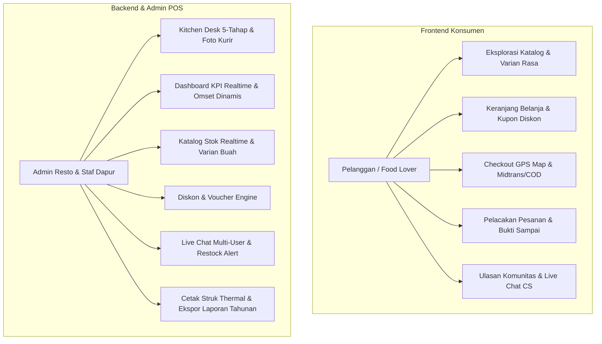

# Product Requirement Document (PRD) — Nefakky Marketplace

**Nama Produk**: Nefakky - Artisanal Food & Culinary Marketplace  
**Versi Dokumen**: 4.0.0 (Updated September 2026)  
**Status**: Production Ready & Fully Validated (`tsc --noEmit` 0 Errors)  
**Target Platform**: Web Responsive (Mobile-First, Tablet, Desktop)  
**Tech Stack**: Next.js 14 (App Router, React 18, TypeScript Strict), Tailwind CSS (Bespoke Theme), Lucide Icons, Laravel 12 API / Fullstack Standalone Mock Engine, Midtrans Snap & Core API, Leaflet / OpenStreetMap, FastExcel & DomPDF.

---

## 1. Ringkasan Eksekutif & Latar Belakang

### 1.1 Visi Produk
**Nefakky** adalah platform marketplace kuliner artisanal *Direct-to-Consumer (D2C)* premium yang menyajikan hidangan rumahan tradisional berkualitas tinggi khas nusantara (misal: Bebek Betutu, Nasi Bakar Rempah, Ayam Taliwang, Jus Buah Segar). Platform ini menghubungkan konsumen langsung dengan dapur resto tanpa potongan komisi tinggi dari agregator pihak ketiga (20%–35%), dengan jaminan transparansi ongkir, pelacakan rute pengiriman interaktif, dan akuntabilitas pesanan berstandar POS restoran modern.

### 1.2 Masalah Bisnis & Solusi
| Masalah Industri | Solusi Nefakky |
| :--- | :--- |
| **Potongan Agregator Ekstrem** (20–35% memangkas marjin resto UMKM) | Transaksi direct checkout mandiri via Midtrans & COD tanpa perantara komisi. |
| **Ongkir Dinamis yang Tidak Transparan** | Formula tarif bertingkat matematis berbasis *Haversine* ($10\text{rb}/10\text{km} + 2.5\text{rb}/\text{kelipatan }3\text{km}$). |
| **Keterlambatan Konfirmasi Pesanan & Ketidakpastian Dapur** | Alur kitchen desk 5-tahap sekuensial dengan live alert konfirmasi pelanggan dan bukti foto serah terima. |
| **Menu Habis Menghilangkan Potensi Pelanggan** | Sistem reservasi prioritas otomatis saat stok habis terintegrasi dengan Live Chat CS untuk pemberitahuan *restock* instan. |
| **Tampilan Template Kaku & "AI Slop"** | Desain editorial *Nordic Citrus & Deep Navy* bersih, tipografi Google Fonts Outfit, tanpa emoji kartun cheesy, mengutamakan ikon vektor Lucide presisi. |

---

## 2. Pengguna & Persona



### 2.1 Persona Utama:
1. **Pelanggan (Customer / Food Lover)**:
   - Ingin memesan makanan lezat higienis dengan deskripsi komposisi rempah jelas.
   - Menginginkan kejelasan estimasi ongkir berdasarkan titik lokasi peta GPS.
   - Membutuhkan update realtime status memasak dan pengantaran kurir.
2. **Staf Dapur & Dispatcher (Kitchen Operations)**:
   - Mengatur urutan memasak berdasarkan antrean pesanan masuk.
   - Membutuhkan tombol kontrol cepat 1-klik untuk memajukan status pesanan.
   - Mengunggah foto serah terima kurir dan bukti uang tunai COD untuk akuntabilitas kas.
3. **Owner / Business Admin**:
   - Memantau tren omset kotor, estimasi laba bersih, dan jumlah pesanan secara dinamis (termasuk pencatatan bazar/promo offline).
   - Melakukan ekspor rekapitulasi penjualan ke Excel dan PDF resmi.
   - Memastikan data keuangan otomatis diarsipkan saat pergantian tahun kalender.

---

## 3. Spesifikasi Kebutuhan Fungsional (Functional Requirements)

### 3.1 Modul Menu & Eksplorasi Hidangan (`/menu`, `/menu/[id]`)
- **FR-MENU-01 (Katalog Multi-Kategori)**: Menampilkan produk dalam 4 kategori (Makanan Berat, Minuman Segar, Menu Hemat, Segera Hadir).
- **FR-MENU-02 (Pencarian & Filter Dinamis)**: Pencarian nama menu secara instan dengan filter harga dan opsi pengurutan (Terpopuler, Rating Tertinggi, Termurah, Termahal).
- **FR-MENU-03 (Detail Produk & Nutrisi)**: Menampilkan galeri foto berkualitas tinggi, rincian bahan rempah, perkiraan kalori, dan pilihan varian rasa (khusus jus: Mangga, Sirsak, Jambu).
- **FR-MENU-04 (Reservasi Stok Habis)**: Apabila stok produk habis, pelanggan dapat menekan tombol *Reservasi Prioritas* yang otomatis mengirimkan pesan terstruktur ke Live Chat CS admin.

### 3.2 Modul Keranjang Belanja & Alur Checkout (`/cart`)
- **FR-CART-01 (Manajemen Keranjang)**: Tambah, kurangi, dan hapus item belanja dengan kalkulasi subtotal dan pajak realtime.
- **FR-CART-02 (Voucher Engine)**: Input kupon promo dengan verifikasi kuota, masa aktif, dan syarat minimum belanja.
- **FR-CART-03 (Geolokasi OpenStreetMap)**: Peta interaktif GPS untuk menentukan titik koordinat antar (*lat/lng*) dan reverse geocoding alamat otomatis.
- **FR-CART-04 (Kalkulator Ongkir Haversine)**:
  $$\text{Tarif Ongkir} = \begin{cases} 
  \text{Rp } 10.000 & \text{jika jarak} \le 10\text{ km} \\ 
  \text{Rp } 10.000 + \left\lceil \dfrac{\text{jarak} - 10}{3} \right\rceil \times \text{Rp } 2.500 & \text{jika jarak} > 10\text{ km} 
  \end{cases}$$
- **FR-CART-05 (Payment Multi-Gateway)**:
  - Midtrans Snap Gateway (BCA/BNI/Mandiri/BRI Virtual Account, GoPay/QRIS Instant, Kartu Kredit).
  - Cash on Delivery (COD) / Bayar di Tempat dengan peringatan uang pas.

### 3.3 Modul Pelacakan Pesanan & Notifikasi (`/notifications`, `/order-status`)
- **FR-TRK-01 (Alur Status 5-Tahap)**: Status sekuensial: `RECEIVED` $\rightarrow$ `PREPARING` $\rightarrow$ `READY` $\rightarrow$ `DELIVERING` $\rightarrow$ `COMPLETED`.
- **FR-TRK-02 (Live Courier Route Map)**: Visualisasi koordinat posisi kurir bergerak menuju lokasi pemesan di peta interaktif.
- **FR-TRK-03 (Konfirmasi Pelanggan)**: Tombol *Konfirmasi Pesanan Telah Sampai* oleh pelanggan yang memicu badge *Dikonfirmasi Pembeli* di admin dashboard.
- **FR-TRK-04 (Cetak Nota Digital & PDF)**: Cetak struk pesanan dan download invoice PDF resmi.

### 3.4 Modul Ulasan Rasa & Komunitas (`/comments`)
- **FR-COM-01 (Ulasan Pelanggan)**: Input testimoni dengan skor bintang (1–5), teks ulasan rasa, dan upload foto makanan.
- **FR-COM-02 (Balasan Resmi Resto)**: Dukungan thread balasan bertingkat dari tim Admin/CS secara realtime.
- **FR-COM-03 (Filter Rating & Foto)**: Filter ulasan dengan lampiran foto dan sortir berdasarkan tanggal terbaru.

### 3.5 Modul Admin Command Center (`/admin`)
- **FR-ADM-01 (Dashboard KPI Dinamis)**:
  - 5 Metrik Utama: Omset Bruto, Estimasi Laba Bersih (40%), Total Pesanan, Rata-rata Nilai Pesanan (AOV), dan Skor CSAT.
  - Grafik Penjualan Dinamis: Timeframe fleksibel (7 Hari, 1 Bulan, 6 Bulan, 1 Tahun) yang terikat pada kalender realtime (September 2026).
  - Modal POS Logger Omset Bazar: Pencatatan omset offline dan event festival yang langsung terakumulasi ke grafik.
  - Sensor Tutup Buku Tahunan Otomatis: Otomasi arsip laporan tahunan saat berganti tahun kalender.
- **FR-ADM-02 (Kitchen Desk & Orders Tab)**:
  - High-demand warning banner saat pesanan aktif $\ge 5$.
  - Tombol aksi status pesanan sekuensial (`Siapkan Pesanan` $\rightarrow$ `Pesanan Siap` $\rightarrow$ `Berangkat Antar` $\rightarrow$ `Tiba di Lokasi` $\rightarrow$ `Selesai & Lunas`).
  - Slot upload foto bukti serah terima kurir dan foto uang tunai COD.
  - Cetak nota kasir thermal 58mm/80mm instan.
- **FR-ADM-03 (Katalog & Manajemen Stok)**:
  - CRUD produk hidangan lengkap dengan pengaturan status *Aktif / Draft*.
  - Pemisahan stok per varian rasa khusus menu minuman jus (Mangga, Sirsak, Jambu) dengan visual dot indikator.
- **FR-ADM-04 (Voucher & Promosi)**:
  - Pembuatan kupon persentase atau nominal rupiah, batas kuota penggunaan, dan tanggal kadaluarsa.
- **FR-ADM-05 (Live Chat Customer Service)**:
  - Daftar kontak pelanggan dengan badge pesan belum dibaca.
  - Tag identifikasi permintaan reservasi produk habis.
  - Tombol 1-klik balasan otomatis informasi *Restock* dapur.
- **FR-ADM-06 (Ekspor Laporan Keuangan)**:
  - Ekspor data laporan transaksi ke format Excel (.xls) dan PDF cetak siap audit.

---

## 4. Kebutuhan Non-Fungsional (Non-Functional Requirements)

### 4.1 Desain & Estetika (Anti-AI-Slop Directive)
- **Palette Warna**: Kombinasi *Nordic Citrus* (`#FF5400`, `#FFB703`) & *Deep Slate/Navy* (`#0F172A`, `#1E293B`) dengan latar belakang bersih (`#F8FAFC`).
- **Tipografi**: Font modern berkarakter (Outfit & Plus Jakarta Sans) dengan hirarki keterbacaan tinggi.
- **Ikonografi**: 100% menggunakan SVG vektor profesional dari **Lucide Icons**. Bebas dari emoji kartun 3D yang mengganggu estetika POS profesional.
- **Micro-Interactions**: Transisi halus (active scale, focus ring, fade-in lembut) tanpa animasi berlebihan yang memperlambat alur kerja.

### 4.2 Performa & Kecepatan
- First Contentful Paint (FCP) $\le 1.0$ detik pada jaringan seluler 4G.
- Lighthouse Performance Score $\ge 90$ untuk seluruh halaman utama.
- Dukungan gambar teroptimasi via Next.js `<Image />` dengan format modern WebP/AVIF.

### 4.3 Keamanan & Keandalan
- Validasi data mutasi sisi server dan pencegahan XSS pada input chat serta komentar ulasan.
- Keamanan transaksi Midtrans melalui verifikasi Order ID unik dan token authorization.
- Penyimpanan lokal (*LocalStorage*) terenkapsulasi dengan mekanisme auto-upgrade data versi terdahulu tanpa merusak state pengguna.

### 4.4 Kualitas Kode & Integritas
- 100% Strict Type-Safety: Bebas dari lint error dan lulus `npx tsc --noEmit` dengan return code 0.
- Standar Aksesibilitas: Memenuhi pedoman WCAG 2.1 Level AA (kontras rasio warna minimum 4.5:1, atribut ARIA, dan navigasi ramah keyboard).

---

## 5. Matriks Siklus Hidup Pesanan (State Transition Matrix)

```
[Customer Checkout] ──> RECEIVED
                          │
                          ▼ (Kitchen: Siapkan Pesanan)
                        PREPARING / COOKING
                          │
                          ▼ (Kitchen: Pesanan Siap)
                        READY
                          │
                          ▼ (Courier: Berangkat Antar)
                        DELIVERING
                          │
                          ▼ (Courier: Tiba di Lokasi)
                        DELIVERED
                          │
                          ▼ (Payment/Confirmation: Selesai & Lunas)
                        COMPLETED
```

---

## 6. Metrik Keberhasilan Produk (Success Metrics)

1. **Transaction Completion Rate (TCR)**: Target $\ge 85\%$ dari sesi checkout berhasil hingga pembayaran selesai.
2. **Order Turnaround Time (OTT)**: Rata-rata waktu dari status `RECEIVED` hingga `READY` $\le 25$ menit.
3. **Customer Satisfaction (CSAT)**: Rating rata-rata ulasan hidangan $\ge 4.7$ dari 5.0 bintang.
4. **Courier POD Compliance**: Kepatuhan unggah foto bukti serah terima $\ge 95\%$ untuk pesanan berbayar COD.
5. **Zero Error Deployment**: 0 fatal runtime crash pada lingkungan produksi.
