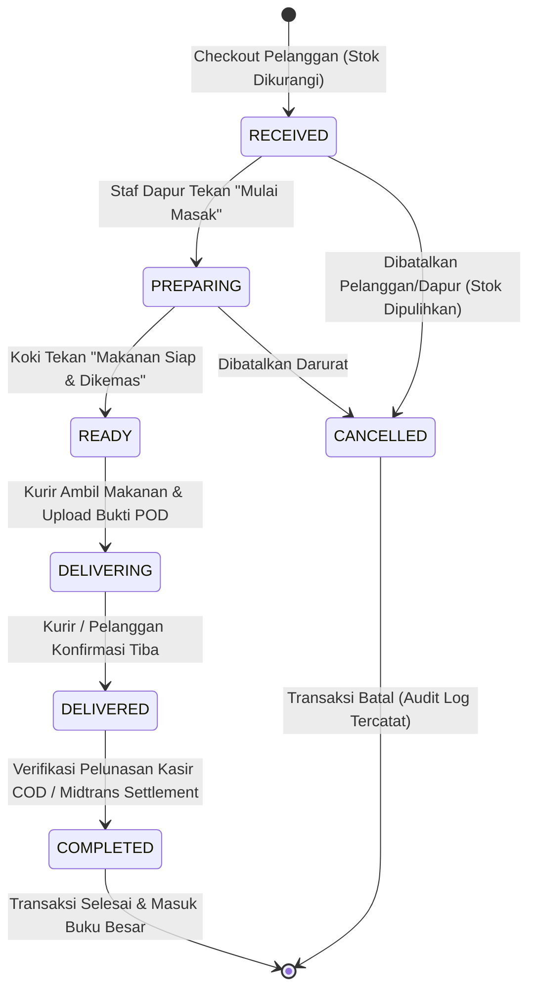
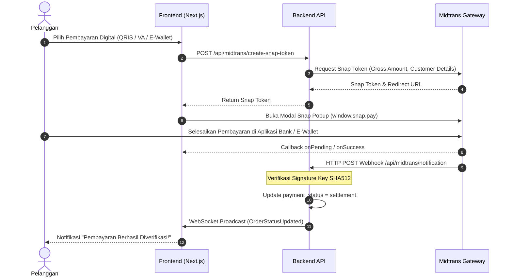

# Alur Kerja Bisnis & Operasional (WORKFLOW.md) — Nefakky Marketplace

**Versi Dokumen**: 4.5.0 (Updated September 2026 — 5-Stage Kitchen POS, Proof-of-Delivery Telemetry, & Annual Archiving)  
**Target Modul**: Alur Hidup Pesanan (Order Lifecycle), State Machine 5-Tahap Dapur, Webhook Gateway Pembayaran Midtrans, Live Camera Snapshot Capture, dan Tutup Buku Tahunan.  
**Penulis**: Tim Pengembang Nefakky (Fatih Ahmad Zakky)  

---

## 1. Alur Transaksi & State Machine Pesanan 5-Tahap

Setiap transaksi pesanan makanan di Nefakky melalui mesin status (*State Machine*) terstruktur yang menjamin keteraturan operasional dapur dan transparansi pelacakan bagi pelanggan.

---

## 2. Rincian 5 Tahapan Alur Kerja Dapur

### Tahap 1: `RECEIVED` (Pesanan Masuk & Diterima Dapur)
* **Pemicu**: Pelanggan menekan tombol "Konfirmasi Pesanan" di halaman `/cart`.
* **Proses Sistem**:
  1. Validasi ketersediaan stok setiap item menu (`stock >= quantity`).
  2. Mengurangi kuantitas stok produk secara atomik.
  3. Menerbitkan nomor order unik (format: `NFK-YYYYMMDD-XXXX`).
  4. Memicu siaran WebSocket `OrderPlaced` ke kanal `orders`.
  5. Pop-up alert dan notifikasi banner berbunyi pada layar Admin Kitchen Desk.

### Tahap 2: `PREPARING` (Sedang Dimasak Koki)
* **Pemicu**: Staf dapur menekan tombol aksi **"Mulai Masak"** di [AdminOrdersTab.tsx](file:///f:/UKK/nefakky3/src/components/admin/AdminOrdersTab.tsx).
* **Proses Sistem**:
  1. Status pesanan diperbarui menjadi `PREPARING`.
  2. Mengaktifkan durasi waktu memasak standar (~30 menit) atau mode lonjakan (*High Demand*) (~45 menit).
  3. Layar pelacakan pelanggan (`/notifications`) menampilkan animasi wajan masak `CookingPot` kustom dan estimasi menit hidangan matang.

### Tahap 3: `READY` (Makanan Siap & Dikemas Rapi)
* **Pemicu**: Koki menyelesaikan hidangan dan menekan tombol **"Makanan Siap"**.
* **Proses Sistem**:
  1. Status diperbarui menjadi `READY`.
  2. Masakan dibungkus dengan kemasan higienis berstempel segel sanitasi.
  3. Mengirimkan sinyal kesiapan paket ke kurir pengantar.

### Tahap 4: `DELIVERING` (Dalam Perjalanan Kurir)
* **Pemicu**: Kurir mengambil paket pesanan dan admin/kurir menekan tombol **"Kirim Kurir"**.
* **Proses Sistem**:
  1. Mengaktifkan fitur **Live Camera Capture** (`LiveCameraModal.tsx`) untuk mengambil foto kurir membawa paket hidangan.
  2. Foto disimpan sebagai bukti serah terima paket (*Proof-of-Delivery / POD*).
  3. Pelanggan melihat status kurir sedang meluncur menuju koordinat alamat tujuan.

### Tahap 5: `DELIVERED` & `COMPLETED` (Tiba di Lokasi & Transaksi Selesai)
* **Pemicu**: Pelanggan menekan tombol *"Konfirmasi Pesanan Diterima"* di aplikasi atau kurir menyelesaikan pengantaran.
* **Proses Sistem**:
  1. Pelanggan dapat mengunggah foto makanan yang sampai dan memberikan skor ulasan 1-5 bintang emas.
  2. Untuk transaksi tunai (COD), kurir menyetorkan uang fisik ke kasir resto, dan status diubah menjadi `COMPLETED`.
  3. Transaksi dicatat ke dalam buku besar omset dan grafik pendapatan bulanan.

---

## 3. Alur Verifikasi Pembayaran Digital Midtrans Snap

---

## 4. Protokol Darurat Lonjakan Pesanan (High Demand Surge Protocol)

Ketika dapur mengalami lonjakan pesanan ekstrem (misal: jam makan siang kantor atau bazar kuliner weekend):
1. Admin mengaktifkan saklar **"Mode Resto Membludak (High Demand)"** di [AdminSettingsTab.tsx](file:///f:/UKK/nefakky3/src/components/admin/AdminSettingsTab.tsx).
2. Sistem secara global:
   - Menambahkan durasi memasak otomatis (+15 menit).
   - Menampilkan banner peringatan darurat bernuansa amber di beranda dan keranjang belanja pelanggan: *"Dapur saat ini sedang melayani pesanan padat. Waktu memasak bertambah ~15 menit untuk menjaga kualitas rasa terbaik."*
   - Memperbarui estimasi stepper pelacakan dari ~30m menjadi ~45m.
3. Setelah antrean dapur kembali terkendali, admin mematikan saklar dan sistem kembali ke waktu normal secara instan.

---

## 5. Alur Sensor Tutup Buku & Arsip Tahunan Otomatis

1. Komponen `annualArchive.ts` membaca waktu kalender nyata sistem.
2. Ketika tahun berganti (misal: dari 2026 ke 2027):
   - Sistem secara otomatis mengunci seluruh rekapitulasi data pesanan tahun 2026.
   - Membuat rekaman arsip permanen `AnnualArchiveRecord` yang berisi ringkasan omset bulanan (Jan–Des).
   - Menyediakan tombol 1-klik untuk mengunduh laporan pembukuan resmi dalam format **Excel Spreadsheet** dan **PDF Akuntansi Resmi**.
